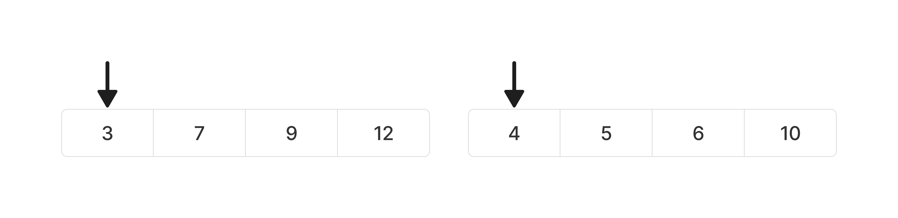
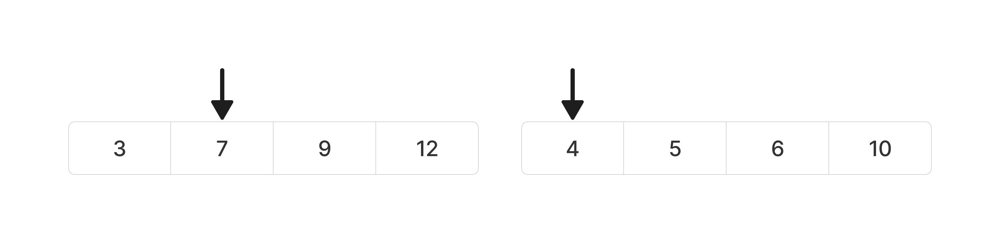

# 정렬 시리즈 1 - Merge Sort
```toc
```
## Merge Sort - 병합정렬
분할정복(divide and conquer)을 사용하는 정렬 알고리즘이다.  
> *분할정복이란 어떤 문제를 두개로 나누어서 각각 해결한 후 결과를 모아 원래의 문제를 해결하는 방식으로, 주로 재귀적 호출을 통해 구현한다.*


## Merge Sort 동작 과정
하나의 리스트를 두개로 균등하게 나눈 후 각각 정렬한다.  
이후 각각 정렬된 두 리스트를 합쳐서 하나의 정렬된 리스트로 만든다.

### Merge Sort 단계
- Divide : 리스트를 2개의 부분 리스트로 나눈다.
- Conquer : 나눈 부분 배열을 정렬한다. 부분 배열의 크기가 최대한 작아질 때 까지 재귀호출한다.
- Combine : 두개의 부분 정렬을 합친다. 

##  Merge Sort 구현 (python)
combine는 각 분할 리스트를 통합한다. 각 분할리스트는 정렬이 되어 있는 상태이므로 각 리스트의 맨 앞끼리 비교하여서 더 작은쪽을 통합 리스트의 첫번째 부터 넣는다.

예시를 보자
현재 두 부분리스트가 있고 각각 conquer되어 정렬이 되어있다.

각 부분 리스트의 앞부분을 비교하여서 작은 것을 통합 리스트에 넣는다. (3과4 비교)


이제 3을 뽑았으므로 앞 부분리스트의 커서를 하나 오른쪽으로 하여 비교한다.

4가 더 작으므로 통합 리스트는다음과 같다.

이런식으로 해서 한쪽 부분리스트를 모두 넣으면 나머지 부분리스트를 다 넣는다.

### Initialize
정렬되지 않은 리스트 선언
```python
# list선언
arr = [8,3,7,2,6,9,1,4]
sorted_arr = [-1]*len(arr)
```

### Merge Sort 함수 정의
```python
# combine에 해당
def merge(arr, left, mid, right):
	i, j = left, mid
	
	for idx in range(left,right):
		if j== right:
			sorted_arr[idx] = arr[i]
			i += 1
			continue
		if i== mid:
			sorted_arr[idx] = arr[j]
			j += 1
			continue
		
		if arr[i] < arr[j]:
			sorted_arr[idx] = arr[i]
			i += 1
		else:
			sorted_arr[idx] = arr[j]
			j += 1
			
	for idx in range(left,right):
		arr[idx] = sorted_arr[idx]

# Merge Sort
def merge_sort(arr, left, right):
	if right-left<2:
		return
	mid = (left + right)//2 # Divide
	merge_sort(arr, left, mid) # Conquer
	merge_sort(arr, mid, right) # Conquer
	merge(arr, left, mid, right) # Combine
```


### 실행
```python
merge_sort(arr, 0, len(arr))

print(arr)
```

#### Result
```Bash
$ python3 mergesort.py
[1, 2, 3, 6, 7, 8, 9]
```
