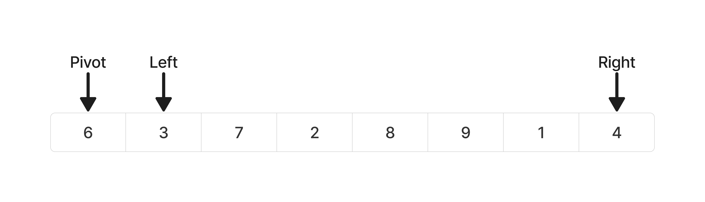
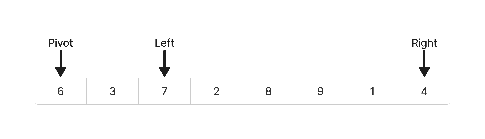

# 정렬 시리즈 2 - Quick Sort
```toc
```
## Quick Sort
분할정복(divide and conquer)을 사용하는 정렬 알고리즘이다.  
> *분할정복이란 어떤 문제를 두개로 나누어서 각각 해결한 후 결과를 모아 원래의 문제를 해결하는 방식으로, 주로 재귀적 호출을 통해 구현한다.*

MergeSort와 동작방식은 비슷하나 QuickSort는 부분정렬을 pivot을 기준으로 비균등하게 분배한다

## Quick Sort 동작 과정
하나의 리스트를 두개로  나눈 후 각각 정렬한다.  
이후 각각 정렬된 두 리스트를 합쳐서 하나의 정렬된 리스트로 만든다.

### Quick Sort 단계
- Divide : 리스트를 피벗을 기준으로 비균등하게 2개의 부분 배열로 나눈다.
- Conquer : 나눈 부분 배열을 정렬한다. 부분 배열의 크기가 최대한 작아질 때 까지 재귀호출한다.
- Combine : 두개의 부분 정렬을 합친다. 

##  Quick Sort 구현 (python)
merge sort에서는 divide를 left와 right의 중간값 mid로 했다면 quick sort에서는 임의의 pivot값으로 divde를 한다. 임의의 pivot값이기 때문에 비균등하게 분배된다고 하는 것 이다.

나는 pivot값을 입력 배열의 맨 처음 값으로 하였다. pivot값을 기준으로 pivot값보다 작은 값들을 모아놓은 부분배열과 과 큰 값들을 모아놓은 부분배열 이렇게 두개의 부분배열로 나눈다.

이제 투 포인터를 가지고 pivot을 기준으로 왼쪽에는 pivot값보다 작은 것들로 오른쪽에는 pivot값보다 큰 것들로 정렬할 것이다. 

아래 예시를 보자

1. left포인터는 pivot보다 작은 값이면 오른쪽으로 넘어가고, right포인터는 반대로 pivot보다 큰 값이면 왼쪽으로 넘어간다
2. left포인터가 pivot보다 큰 값을 만나면 포인터 stop, 반대로 right포인터는 pivot보다 작은 값을 만나면 포인터 stop! (즉, 포인터가 큰값이나 작은값을 만날때까지 계속 움직인다.)
	
	left포인터는 하나 이동 후 큰 값을 만나고 right는 하나도 못 움직이고 작은값을 바로 만났다
3. 이제 left포인터가 가르키는 값과 right포인터가 가르키는 값을 교환한다! 교환후 각 포인터는 오른쪽, 왼쪽 방향으로 계속 진행 시킨다.
4. 이후 1~3번을 반복하다 보면


### Initialize
정렬되지 않은 리스트 선언
```python
# list선언
arr = [8,3,7,2,6,9,1,4]
```

### Quick Sort 함수 정의
```python
def divide(arr, left, right):
	pivot = arr[left]
	pivot_idx = left
	left+=1
	while left <= right:
		while arr[left] < pivot:
			left+=1
		while arr[right] > pivot:
			right-=1
		if left <= right:
			arr[left], arr[right] = arr[right], arr[left]
			left, right = left+1, right-1
	arr[pivot_idx], arr[right] = arr[right], arr[pivot_idx]
	
	return left

# Quick Sort
def quick_sort(arr, left, right):
	if right-left<2:
		return
	pivot_idx = divide(arr, left, right) # Divide
	quick_sort(arr, left, pivot_idx-1) # Conquer
	quick_sort(arr, pivot_idx, right) # Conquer
```


### 실행
```python
quick_sort(arr, 0, len(arr)-1)

print(arr)
```

#### Result
```Bash
$ python3 quicksort.py
[1, 2, 3, 6, 7, 8, 9]
```
