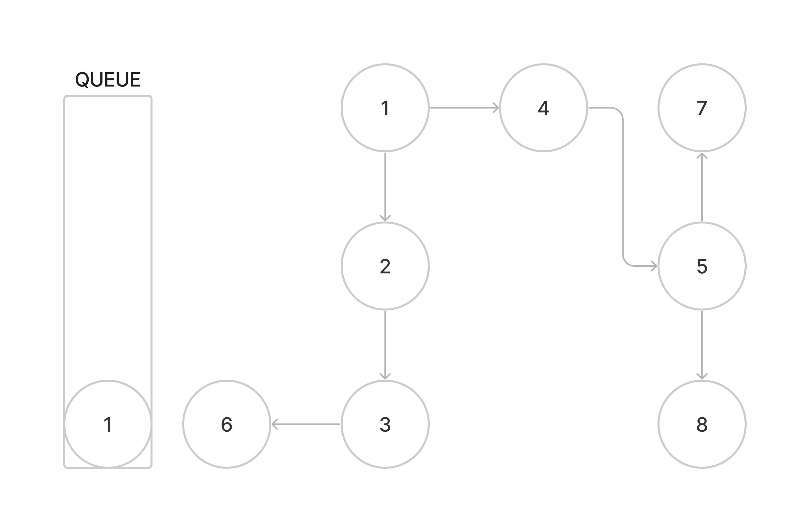
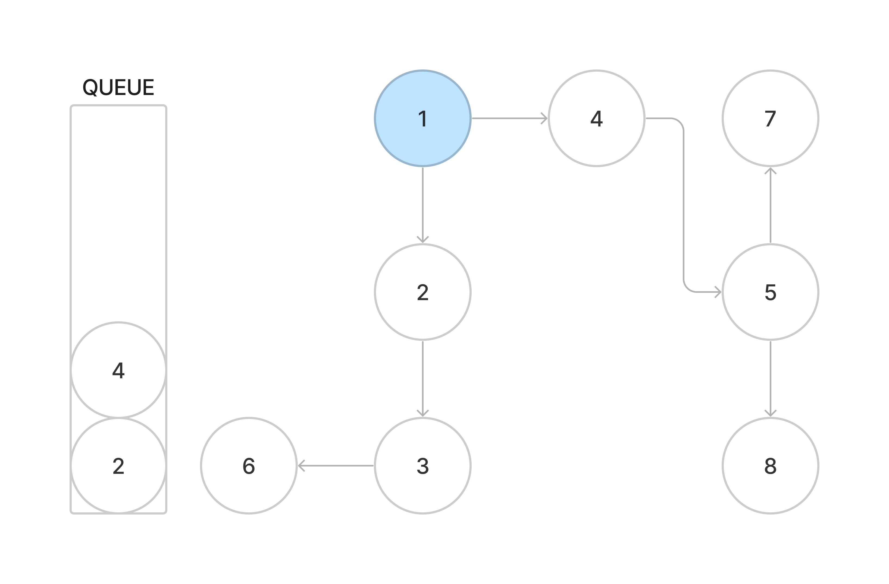
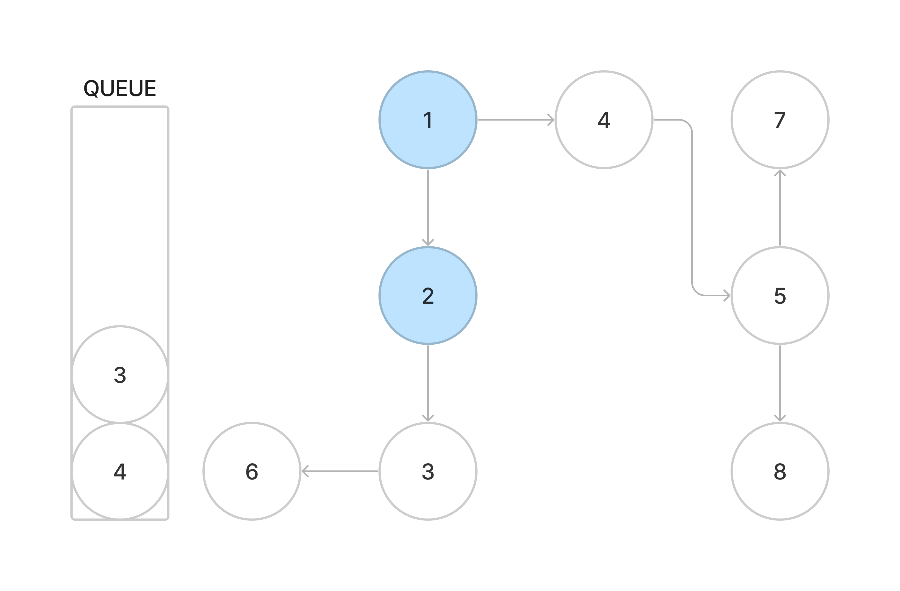
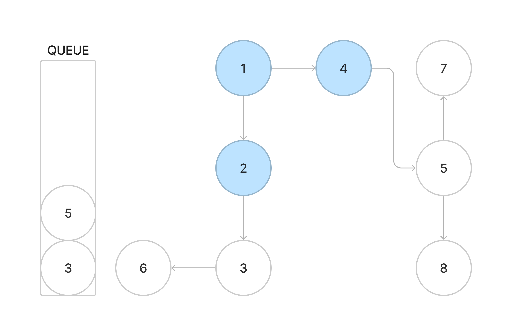

# 최단거리 시리즈 1 - BFS
```toc
```
## BFS - 너비 우선 탐색(BFS, Breadth-First Search)

루트노드부터 시작해서 인접한 노드를 탐색하는 알고리즘

두 노드의 최단경로를 찾을 때 주로 사용된다.

## BFS 동작 과정

FIFO의 Queue 자료구조를 사용한다. 방문한 노드의 인접한 노드들을 큐에 넣고 먼저 삽입한 노드부터 차례대로 탐색하게 된다. 이 때 방문한 노드를 다시 탐색하지 않기 위해 방문처리를 해야한다.

동작과정을 나타내면 다음과 같다
1. 시작 노드를 큐에 넣는다
2. 큐에서 노드를 꺼낸 후 방문처리 한다.
3. 꺼낸 노드의 인접한 노드들을 큐에 넣는다.
4. 큐에 아무것도 없을 때 까지 2-3번 반복

다음 그림을 보고 어떤 과정으로 탐색을 하게 되는 지 보면


1. 1번 노드(시작노드)를 큐에 넣는다.
2. 큐에서 1번노드를 꺼낸 후 방문처리한다.
3. 1번노드의 인접한 노드 (2,4)를 큐에 넣는다



그러면 2,4번 노드가 큐에 들어가게 된다
이후 1번노드와 똑같은 과정이 2번노드에 적용된다

2. 큐에서 2번노드를 꺼낸 후 방문처리한다.
3. 그리고 2번노드의 인접한 노드 (3)을 큐에 넣는다


3번 노드를 추가했지만 선입선출인 큐를 사용했기 때문에 이전에 큐에 넣어두었던 4번 노드(1번노드의 이웃)을 먼저 탐색한다
2. 큐에서 4번노드를 꺼낸 후 방문처리한다.
3. 그리고 4번노드의 인접한 노드 (5)를 큐에 넣는다


이후 3 -> 5 -> 6 -> 7,8 노드 순서대로 탐색을 하게 된다.

## BFS 구현 (python)

위 그림의 그래프를 토대로 구현하자

### graph 선언
먼저 노드와의 관계가 저장된 자료구조graph 를 선언한다.
```python
graph = {
	1: [2, 4],
	2: [3],
	3: [6],
	4: [5],
	5: [7, 8],
	6: [3],
	7: [5],
	8: [5]
}
```

### BFS 함수 정의
```python
def bfs(start):
	queue = deque([])
	visited = {}
	depth = 0
	# 시작 노드 큐에 넣는다.
	queue.append(start)
	# 시작 노드에 대해 방문 처리
	visited[start] = depth

	# 큐가 빌때까지 반복
	while queue:
		# 큐에서 노드를 꺼낸다
		cur = queue.popleft()
		depth += 1
		print(cur)
		# graph[x]는 x의 인접한 노드들이 담겨있다.
		for neighbor in graph[cur]:
			# 인접한 노드가 방문한 노드가 아닐 때만 큐에 넣어준다.
			if neighbor not in visited:
				queue.append(neighbor)
				visited[cur] = depth
```
시작노드를 큐에 넣고 시작노드에 대해 방문처리를 한다.
> 여기서 depth는 시작노드로 부터 방문노드까지 몇번만에 갈 수 있는지에 대한 정보이다.

- 큐에서 노드를 꺼낸다.
- 꺼낸 노드의 인접노드들을 큐에 추가한다.
- 큐에 추가할 때 방문처리  
이 과정의 반복이다.

### result

```Bash
$ python3 BFS.py
1 2 4 3 5 6 7 8
```
