# 최단거리 시리즈 2 - Dijkstra
```toc
```
## Dijkstra - 다익스트라
**다익스트라 알고리즘**은 **다이나믹프로그래밍**을 이용한 최단거리 알고리즘이다.  
다익스트라 알고리즘은 특정 정점에서 다른 모든 정점까지의 최단 거리를 알려준다.
단, 음의 간선을 표현할 수 없다. 이 특징 때문에 현실세계의 적합한 최단거리 알고리즘으로 알려져있다.

다익스트라 알고리즘이 다이나믹 프로그래밍인 이유는 알고리즘에서 최단거리를 구할 때 이전에 구한 최단거리를 이용하여 그 최단거리를 갱신하는 방식이기 때문이다. 즉, **최단거리는 여러개의 최단거리로 이루어져있다.**

## Dijkstra 동작방식
### Operation
1. 출발 노드 설정
2. 출발 노드를 기준으로 각 노드의 최소비용을 저장
3. 방문하지 않은 노드들 중 가장 적은 비용의 노드를 선택
4. 해당 노드를 거쳐서 다른 노드들로 갔을 때 비용과 최소비용을 비교하여 (더 작으면) 업데이트 해준다.
5. 3번과 4번을 반복한다 (모두 방문할 때 까지)

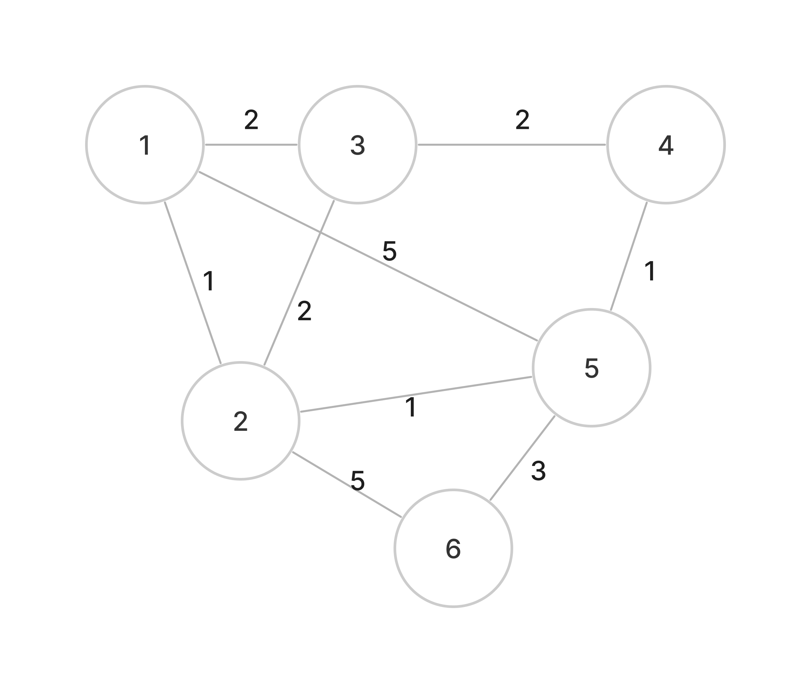
위 그림과 같은 그래프에서 1번노드를 출발노드로 하여서 다익스트라를 통해 각 노드별 최단거리를 구해보자

출발노드를 설정(1번,2번 operation)한 이후 3번, 4번 operation 이 반복될것이다

#### (Operation - 1 & 2)

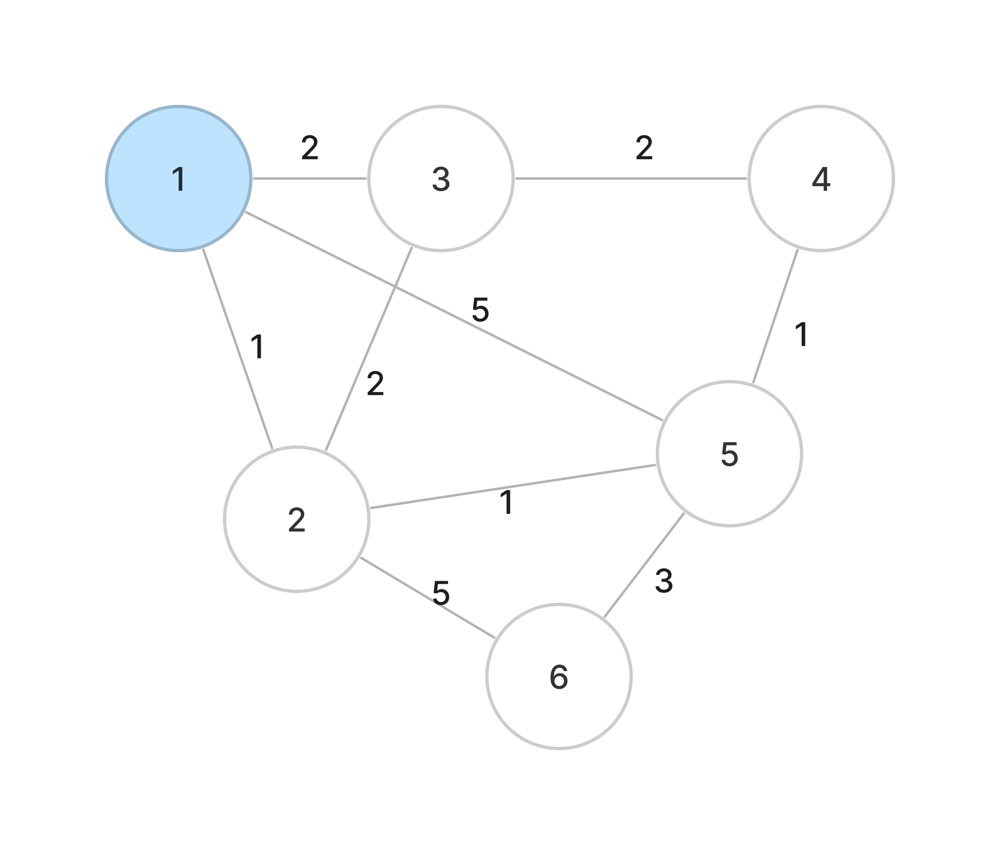
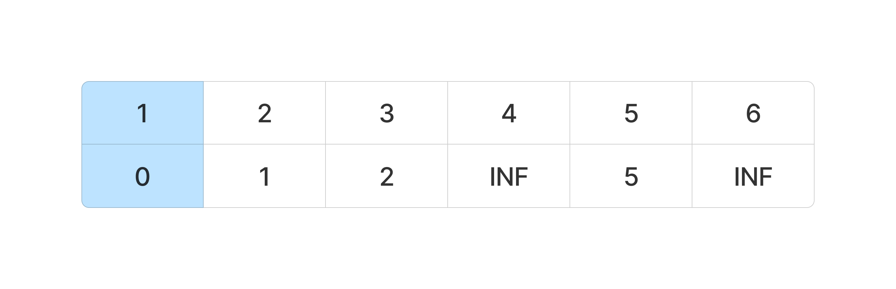

#### (Operation - 3)
방문하지 않은 노드들 중 가장 적은 비용의 노드를 선택 => 2번 노드
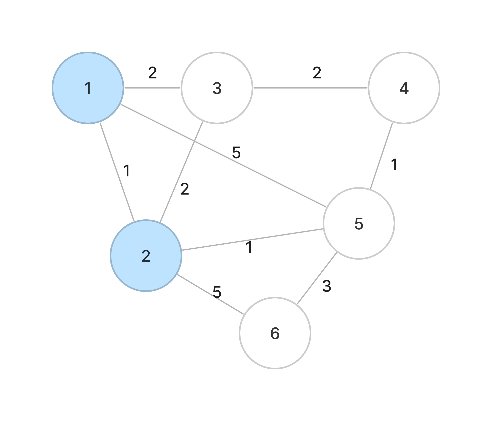
#### (Operation - 4)
해당 노드를 거쳐서 다른 노드들로 갔을 때 비용과 현재 최소비용을 비교하여 (더 작으면) 업데이트 해준다.
- **현재 최소비용**
	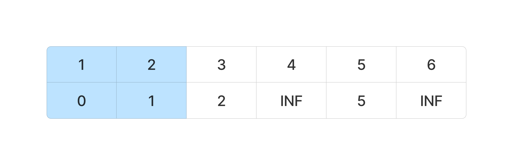

- **2번을 걸쳐 3,4,5,6을 가는 비용**   
	2번을 거쳐 가는 비용은  
	(2번을 가는 비용)+ (2에서 3,4,5,6까지 비용) 이 된다.  
	2번을 가는 비용은 현재 1이다.
	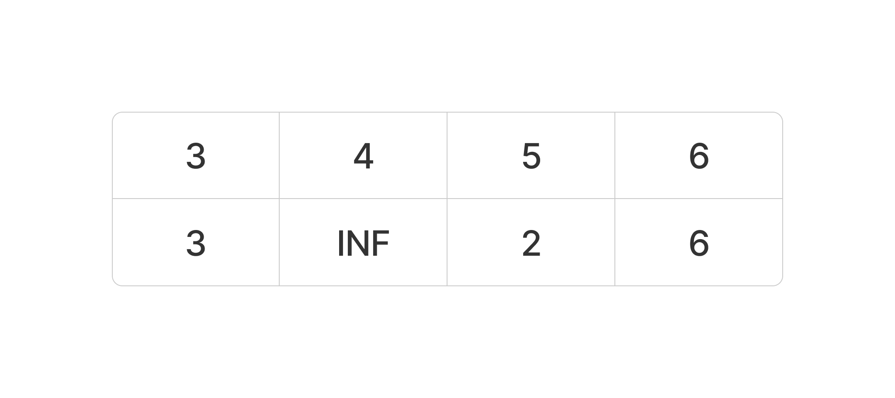

2가지를 비교해서 2번을 거쳐가는 것이 비용이 더 작다면 업데이트 해준다!!
5번 노드와 6번 노드를 갈 때 2번을 거치는 것이 더 유리하다.. 최소비용은 다음과 같이 업데이트된다
- 업데이트된 최소비용 
	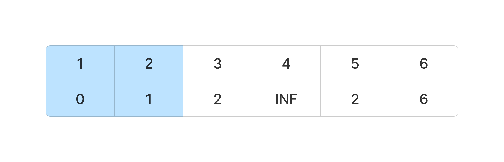

#### (Operation - 3)
방문하지 않은 노드들 중 가장 적은 비용의 노드를 선택 => 3번 노드 (5번 노드도 가능)
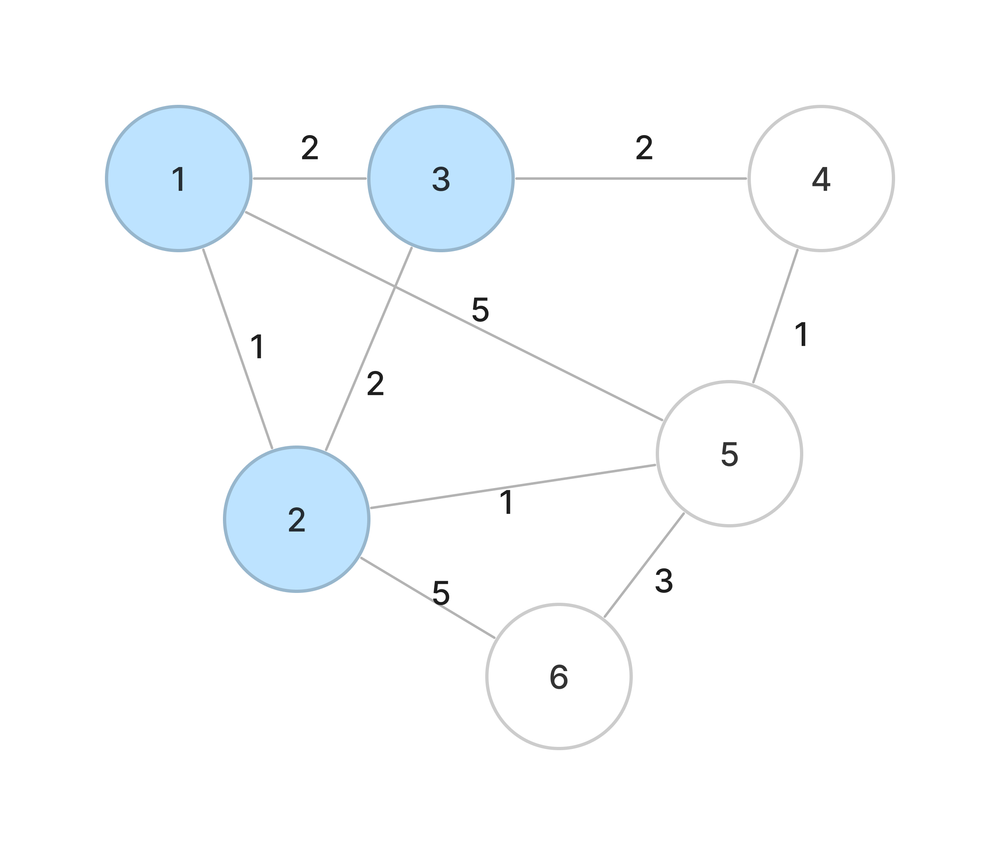
#### (Operation - 4)
해당 노드를 거쳐서 다른 노드들로 갔을 때 비용과 현재 최소비용을 비교하여 (더 작으면) 업데이트 해준다.
- **현재 최소비용**
	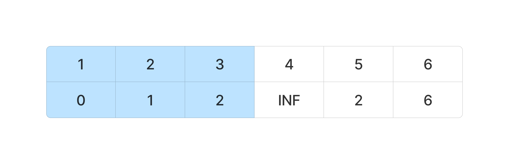

- **3번을 걸쳐 4,5,6을 가는 비용**  
	3번을 거쳐 가는 비용은  
	(3번을 가는 비용)+ (3에서 4,5,6까지 비용) 이 된다.  
	3번을 가는 비용은 현재 2이다.
	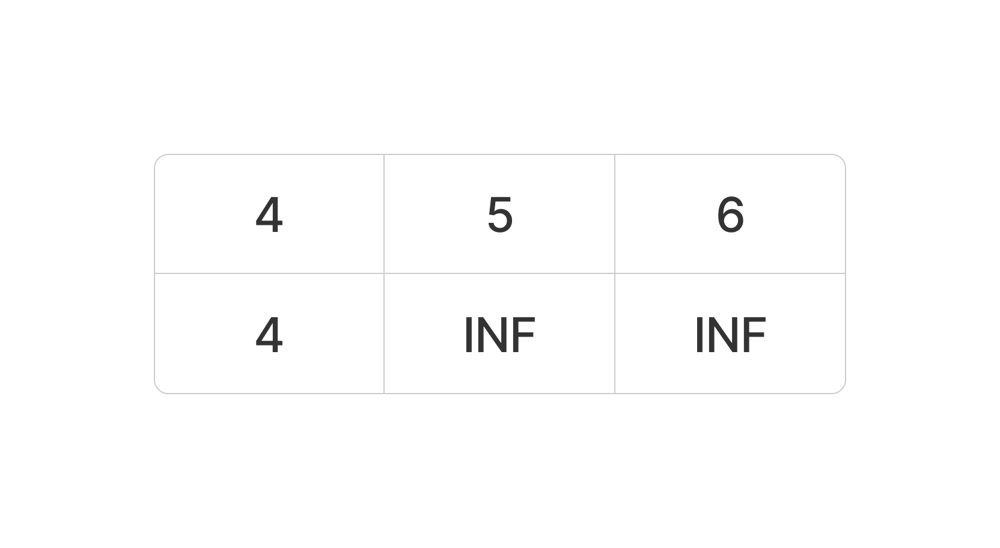

2가지를 비교해서 2번을 거쳐가는 것이 비용이 더 작다면 업데이트 해준다!!  
4번 노드와 3번을 거치는 것이 더 유리하다.. 최소비용은 다음과 같이 업데이트된다.
- 업데이트된 최소비용 
	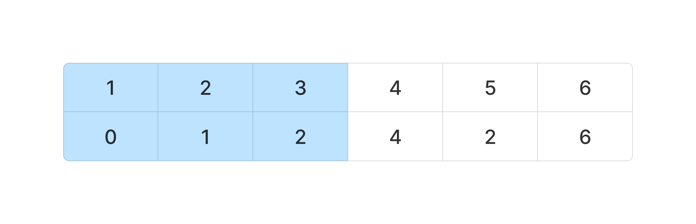

이후 모든 노드를 방문할 때까지 3번 4번 operation을 반복하면 1번노드에서 나머지 노드로 가는 최소비용을 구할 수 있게된다.

## Dijkstra 구현(python) - 1 : 선형탐색 

Operation을 상기하면서 구현해보자
1. 출발 노드 설정
2. 출발 노드를 기준으로 각 노드의 최소비용을 저장
3. 방문하지 않은 노드들 중 가장 적은 비용의 노드를 선택
4. 해당 노드를 거쳐서 다른 노드들로 갔을 때 비용과 최소비용을 비교하여 (더 작으면) 업데이트 해준다.
5. 3번과 4번을 반복한다 (모두 방문할 때 까지)

### Initialize
**dist 배열** - dp 배열, 노드를 방문할 때마다 업데이트가 될 수 있다.  
**visited 배열** - 방문한 노드를 기록한다.   
**graph** - 노드들의 관계가 저장된 자료구조 graph 를 선언한다. (위 예시에서 사용한 그래프 사용).  
- *graph[x] 에는 x와 인접한 노드들의 (이름, 거리)가 배열로 저장된다.*
```python
INF = int(1e9)
# 노드 개수
n = 6

dist = [INF] * (n+1)
visited = [False] * (n+1)
graph = [
	[],
	[(1,2),(2,3),(5,5)],
	[(1,1),(3,2),(5,1),(6,5)],
	[(1,2),(2,2),(4,2)],
	[(3,2),(5,1)],
	[(1,1),(2,5),(4,1)],
	[(2,5),(5,3)]
]
```

### Dijkstra 함수 정의
```python
def dijkstra(graph, start):
	# start의 dist 0으로 초기화
	dist[start] = 0
	
	for i in range(1, n+1):
		# 방문하지 않은 노드중 최소 거리의 노드를 선택한다
		mn = INF
		mn_idx = -1
		for idx in range(1,n+1):
			if not visited[idx]:
				if dist[idx] < mn:
					mn_idx = idx
					mn = dist[idx]
		visited[mn_idx] = True
	
		# 해당 노드를 거쳐서 다른 노드들로 갔을 때 비용과 최소비용을 비교하여(더작으면)업데이트 해준다.
		for neighbor in graph[mn_idx]:
			node, distance = neighbor
		
			# 최소거리의 노드를 거쳤을 때가 더 작으면 업데이트 한다.
			if dist[node] > dist[mn_idx] + distance:
				dist[node] = dist[mn_idx] + distance

```

### 실행
```python
# 1번 노드를 출발노드로
dijkstra(graph, 1)

for i in range(1,n+1):
	print(dist[i], end=' ')
print()
```

#### Result

```Bash
$ python3 dijkstra.py
0 1 2 3 2 6 
```

## Dijkstra 구현(python) - 2 : 우선순위 큐 사용
위처럼 최소비용의 노드를 찾을 때 모든 노드를 확인한다면 O(n^2)의 시간이 걸린다.  
최소비용의 노드를 찾을 때 heap구조를 사용하면 O(n\*log n)으로 줄일 수 있다.

### Initialize
**dist 배열** - dp 배열, 노드를 방문할 때마다 업데이트가 될 수 있다.  
**visited 배열** -  필요 x , 이미 방문한 노드는 dist가 확정된 상태기 때문에 해당 노드를  heappush할 일이 없다   
**graph** - 노드들의 관계가 저장된 자료구조 graph 를 선언한다. (위 예시에서 사용한 그래프 사용).  
- *graph[x] 에는 x와 인접한 노드들의 (이름, 거리)가 배열로 저장된다.*
```python
import heapq

INF = int(1e9)
# 노드 개수
n = 6

dist = [INF] * (n+1)
graph = [
	[],
	[(1,2),(2,3),(5,5)],
	[(1,1),(3,2),(5,1),(6,5)],
	[(1,2),(2,2),(4,2)],
	[(3,2),(5,1)],
	[(1,1),(2,5),(4,1)],
	[(2,5),(5,3)]
]
```

### Dijkstra 함수 정의
```python
def dijkstra(graph, start):
	# 우선순위 큐 선언
	pq = []
	# start의 dist 0으로 초기화
	dist[start] = 0
	
	heapq.heappush(pq, (dist[start],start))
	
	while pq:
		distance, node = heapq.heappop(pq)

		# 기존 최소비용보다 거리가 길면 비교할 필요가 없다.
		if distance > dist[node]:
			continue
		
		# 해당 노드를 거쳐서 다른 노드들로 갔을 때 비용과 최소비용을 비교하여(더작으면)업데이트 해준다.
		for neighbor in graph[node]:
			neighbor_node, neighbor_distance = neighbor
			
			# 최소거리의 노드를 거쳤을 때가 더 작으면 업데이트 한다.
			if dist[neighbor_node] > dist[node] + neighbor_distance:
				# 이 때 업데이트 된 노드를 힙큐에 다시 넣는다
				heapq.heappush(pq,(dist[node] + neighbor_distance, neighbor_node))
				dist[neighbor_node] = dist[node] + neighbor_distance

```

### 실행
```python
# 1번 노드를 출발노드로
dijkstra(graph, 1)

for i in range(1,n+1):
	print(dist[i], end=' ')
print()
```

#### Result

```Bash
$ python3 dijkstra.py
0 1 2 3 2 6 
```

## 최단 경로는 어떻게 알 수 있을까?
다익스트라는 한 정점에서 다른 모든 정점까지의 최소 비용을 알려주는 알고리즘이다.  
만약 다른 정점까지 가는 최소 경로까지 알고싶으면 어떻게 해야될까?

다익스트라 알고리즘을 다시 살펴보자  
현재 A노드를 방문했고 A는 B,C노드와 인접하다고 하면 기존 알고 있던 **<출발부터 B,C의 거리>** 와 **<A를 거쳐서 B,C를 가는 거리>** 를 비교한다
> Distance of B(or C) vs Distance of A + Distance of A to B(or C)

이렇게 두가지를 비교해서 A를 거쳐서 B,C를 가는 것이 더 작으면 우선순위 큐에 넣어주었다.  
우선순위 큐에 넣어줄 때는 (갱신된 거리, 노드 이름) 이렇게 넣어준다

기존 알고 있던 B의 거리보다 A를 거쳐 B를 가는 것이 더 짧아서 우선순위 큐에 들어가는 상황을 보자  
그렇다면 우선순위 큐에는 (dist(A) + dist(A to B), B)가 될 것이고 추후에 이 것을 방문하게 되면(pop되면) B의 최소거리가 갱신 될 것이다.  

여기서 최단 경로는 어떻게 알 수 있냐?  
우선순위큐에 들어간 요소를 방문해서 거리가 갱신이 되는 시점에 그 B가 어디서 부터 왔는지 알 수 있으면 된다. 이렇게 하려면 우선순위 큐에 넣는 시점에 해당 노드가 어떤노드를 거쳐서 오는지에 대한 정보를 적어주면 된다.  

위 예시에서는  (dist(A) + dist(A to B), B , A) 가 될 것이다 즉 B는 A로 부터 왔다는 얘기가 되고, 추후에 이 것을 통해 B를 방문해 최단경로가 갱신이 된다면 (갱신된 최단경로, B, B가 어디서 왔는지)가 적혀있을 것이다.  
기존에는 B에 갱신된 최단경로만 넣어줬다면 이제는 B가 어디서 왔는지에 대한 정보까지 남길 수 있다.

이제 이런식으로 다익스트라를 통해 출발노드에 대해서 모든 노드까지의 거리를 구했다고하자.

출발노드로부터 A,B,C,D에 대한 최소거리가 dist배열에 있다고 하자.  
출발노드 부터 D의 최단 경로는 어떻게 될까?  
dist배열에는 D의 최단거리에 더해 아까 어디로부터 왔는지에 대한 정보가 있다. D는 B로부터 왔다고 하면 
최단경로는 \[D <- B]가 일단 적힐 것이고, 이제 B를 보면 B에는 A로 부터 왔다고 적혀있다.  
이제 최단경로는 \[D <- B <- A] 가 되고 A를 보면 A는 출발노드로 부터 왔다고 적혀있다.  
최종적으로 최단경로는 \[출발노드 -> A -> B -> D] 가 될 것이다.