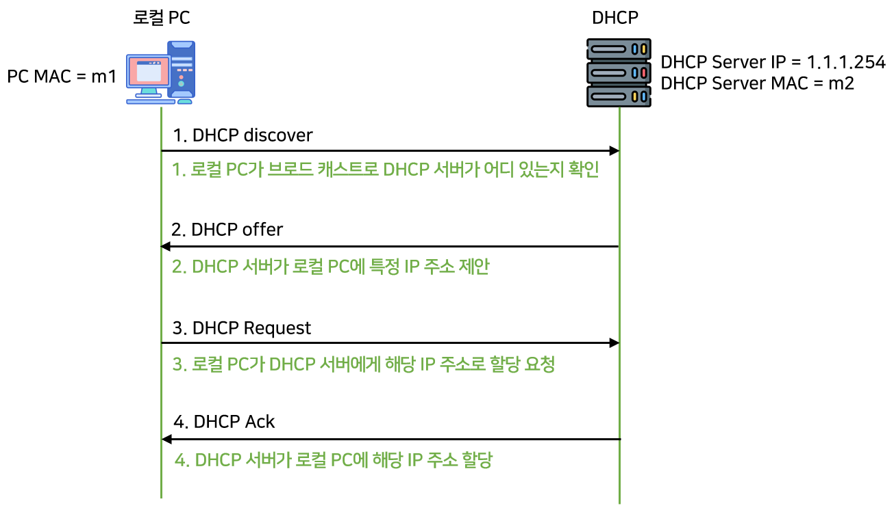
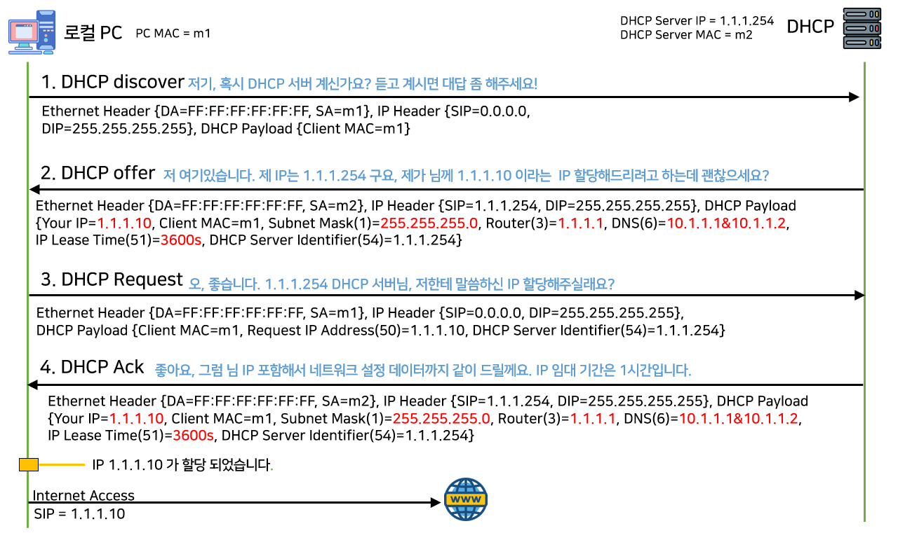
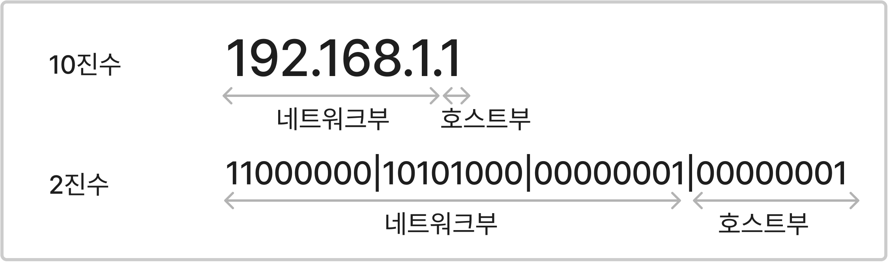
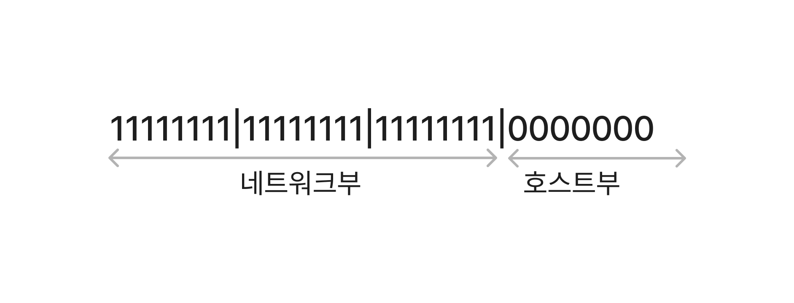
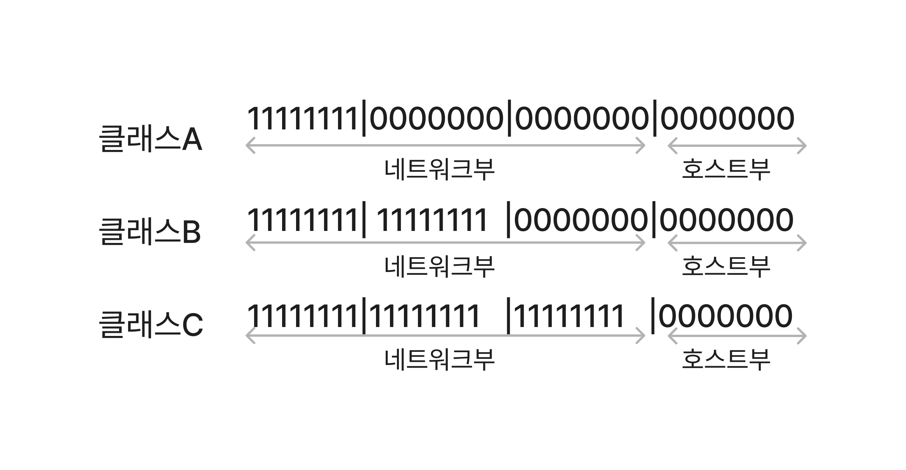
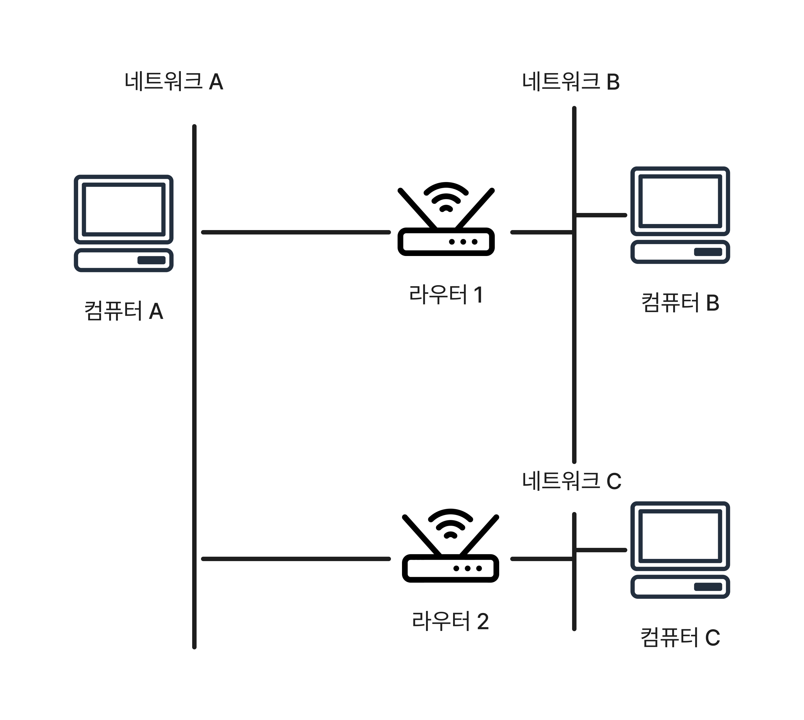

# 네트워크를 실현하는 기술 - IP 주소

## DHCP (Dynamic Host Configuration Protocol)
컴퓨터에 인터넷 회선을 최초로 연결하면 바로 인터넷에 연결되는 것을 볼 수 있다.  
이는 라우터에서 IP주소가 없는 컴퓨터에 IP주소를 자동으로 할당하는 기술인 **DHCP**가 있어서 가능한 것이다.

그림출처 - [DHCP(Dynamic Host Configuration Protocol)란? - 로스카츠의 AI 머신러닝 (losskatsu.github.io)](https://losskatsu.github.io/os-kernel/dhcp/#2-dhcp%EC%9D%98-%EC%97%AD%ED%95%A0)
DHCP는 다음 네단계흐름에 따라 통신하여 네트워크 설정을 가져온다.
1. DHCP Discover : DHCP 클라이언트가 DHCP 서버를 찾고자 네트워크에 통신하는 것
3. DHCP Offer : DHCP 서버가 DHCP 클라이언트에 설정을 제안하는 통신을 하는 것
4. DHCP Request : DHCP 클라이언트가 DHCP 서버에 제안된 설정의 세부사항을 요청하는 통신을 하는 것
5. DHCP ACK : DHCP 서버가 DHCP 클라이언트에 설정의 세부 사항을 지정하는 통신을 하는 것

## 서브넷 마스크
IPc4 주소는 xxx.xxx.xxx.xxx 형식으로 표기한다. 10진수로 표현되지만 실제로는 8자리 2진수 4개이다.  
IP주소는 **네트워크부**와 **호스트부**로 나뉜다.

**네트워크부** - 어떤 네트워크를 나타내는 지에 대한 정보
**호스트부** - 그 네트워크 안의 컴퓨터를 특정하는 정보

IPv4에서 네트워크부가 어디부터 어디까지인지 나타내는 것이 **서브넷 마스크**(넷마스크) 이다.

IP주소 정보를 예를들어 설명하면
- IP주소 : 192.168.1.1
- 서브넷 마스크 : 255.255.255.0
- 네트워크주소 : 192.168.1.0
- 브로드캐스트 주소 :192.168.1.255

서브넷 마스크를 2진수로 표현하면 다음 그림과 같다.

여기서 1부분이 네트워크부이고 0 부분이 호스트부가 된다.  
8자리의 1진수 한덩어리를 옥텟이라고하고 이 경우 1옥텟부터 3옥텟까지가 **네트워크부** 4옥텟이 **호스트부**가 된다.

## IP주소 할당
앞서 말했듯이 IP주소는 처음부터 있는 것이아니라 따로 할당해서 사용한다.  
이 때 호스트부를 바꾸어서 IP주소를 할당한다.
>호스트부의 시작 숫자(2진수에서 모두 0일 때) 과 마지막 숫자(호스트부가 모두 1일 때)는 할당할 수 없다
> **시작 숫자**는 네트워크 주소라고 불리며 그 네트워크 자체를 나타낸다
> **마지막 숫자**는 브로드캐스트 주소이며, 로컬 네트워크 전체에 통신을 보낼 때 사용한다.
> *실제로는 라우터같은 네트워크 기기에도 IP주소가 할당되므로 실제로 컴퓨터나 프린터에 할당할 수 있는 IP는 더 줄어든다*

- **CIDR 표기법** - <네트워크 주소>/<서브넷 마스크의 비트수>  
	위에서 든 예시를 CIDR표기법으로 쓰면 192.168.1.0/24로 쓸 수 있다.

## 클래스 및 가변 길이 서브넷 마스크

IP주소는 네트워크부 길이에 따라 클래스가 나뉜다. 주요 클래스는 아래 그림과 같이 A,B,C 세가지 유형이다

서브넷 마스크가 반드시 클래스를 따르는 것은 아니며 클래스의 서브넷 마스크 길이를 변경할 수 있다.  
이를 **가변길이 서브넷 마스크** 라고 부른다.

호스트부를 늘리면 더 많은 컴퓨터에 IP를 할당할 수 있지만 ARP등으로 브로드캐스트 통신량이 증가하기 때문에 필요한 만큼 적절하게 설정해야한다.

## 데이터 전송 메커니즘
앞서서 MAC주소와 ARP 기술을 이용하여 데이터를 전송하는 흐름을 보았다.

다른 네트워크에 속한 컴퓨터와 통신할 때 흐름에 대해서 알아보자.  
각각 다른 네트워크에 속해 있는 컴퓨터 A,B,C가 있다.

1. **컴퓨터A -> 컴퓨터B**  
	컴퓨터 A가 컴퓨터B에 데이터를 보낼 때 어떤 라우터로 보내야 할지 모르는 경우 컴퓨터 A는 기본 게이트웨이라고 하는 라우터로 데이터를 송신한다. 위 상황에서는 라우터1이 기본 게이트웨이로 지정되어 있다.  
	위에서 라우터1은 네트워크 A와  네트워크 B에 모두 속해있으므로 컴퓨터 A의 데이터를 컴퓨터B로 전송할 수 있다.  
	이 때 라우터가 수행하는 작업을 **라우팅** 이라고 한다.

> 기본 게이트웨이란 '규정 수신처'를 의미하며, 전송할 라우터가 정해져 있지 않은 경우에는 반드시 이곳으로 보낸다고 규칙으로 정해 놓았다.

2. **컴퓨터A -> 컴퓨터C**  
	컴퓨터A는 **라우팅테이블**을 통해 네트워크C에 속한 컴퓨터C로 데이터를 보낼 때는 라우터2로 보낸다는 것을 알고 있다.  
	라우팅 테이블에는 네트워크로의 통신을 어느 라우터로 전달해야 하는지 기록되어 있다. 라우팅 테이블에 따라 기본 게이트웨이로 보내거나 직접 대상 라우터로 보낼 수 있는 구조로 되었다.
	
1. **라우터 -> 라우터**  
	인터넷이나 기업 네트워크에서는 라우터가 여러대 연결되어 있고, 그 라우터를 통해 통신한다.
	라우터 또한 기본 게이트웨이 (라우터는 기본 라우트라고 부른다) 가 있어서 보낼 곳을 모르는 네트워크가 있을 때는 기본 게이트웨이에 통신을 전송해 기본 라우터가 다신 전송처를 찾는 식으로 버킷 릴레이를 반복하여 네트워크가 성립된다.
