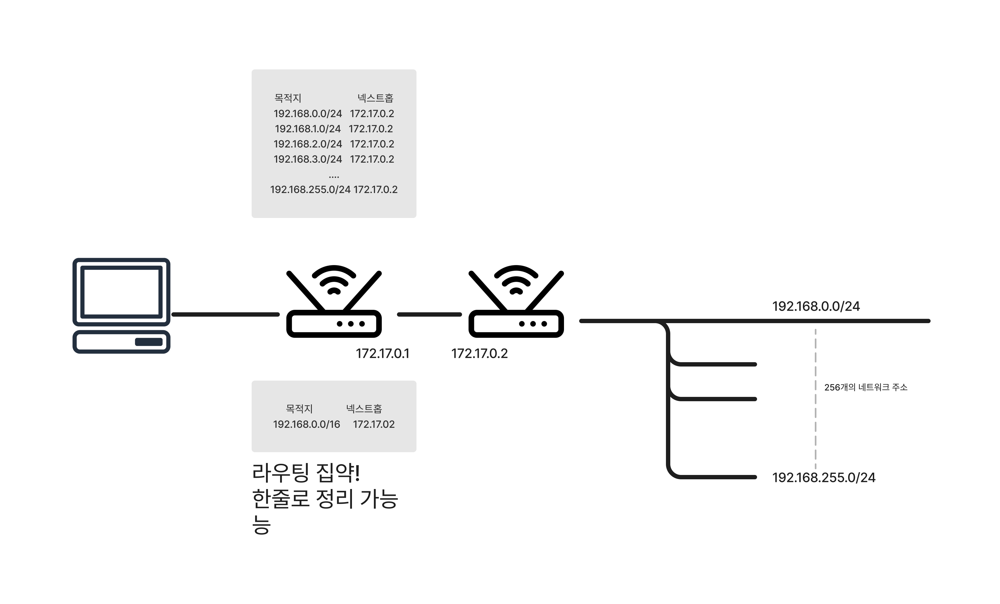

# 네트워크를 실현하는 기술 - 네트워크 프로토콜


```toc
```

## 네트워크 계층

네트워크 계층에 따른 여러가지 스위치

1. **L2 스위치 (Data Link Layer Switch)**: L2 스위치는 데이터 링크 계층에서 동작하는 장비로, 이더넷 프레임을 기반으로 패킷을 전달한다. 주로 MAC 주소를 사용하여 패킷을 스위치 포트 간에 전송하며, 이를 통해 스위치 내부에서 패킷의 전달 경로를 결정한다. L2 스위치는 브로드캐스트 도메인을 분리하여 네트워크 트래픽을 효율적으로 관리한다.  
     
2. **L3 스위치 (Network Layer Switch)**: L3 스위치는 네트워크 계층에서 동작하며, IP 주소를 기반으로 패킷을 전달한다. IP 라우팅 기능을 내장하고 있어서 다른 네트워크 또는 서브넷 간의 패킷 라우팅을 수행할 수 있다. L3 스위치는 주로 라우터와 유사한 기능을 수행하지만, 일반적으로 더 빠르고 효율적으로 패킷을 처리한다.  
>**라우터**는 L3스위치보다 앞서서 나온 네트워크 장비로 L3스위치가 라우터보다 더 많은 회선을 수용할 수 있다.  
>L3스위치와 같이 네트워크 계층에서 동작하지만 다음과 같은 차이점이 있다.  
>1. 광회선이나 전화선 같은 이더넷이 아닌 회선도 수용할 수 있다
>2. 2. 보안적인 측면에서 L3스위치보다 뛰어나다.

3. **L4 스위치 (Transport Layer Switch)**: L4 스위치는 전송 계층에서 동작하며, 주로 포트 번호를 기반으로한 패킷 분배와 로드 밸런싱을 수행한다. 이를 통해 서로 다른 서버나 서비스 간에 트래픽을 분산시키고 성능을 최적화할 수 있다. L4 스위치는 주로 로드 밸런서 또는 애플리케이션 전달 컨트롤러로 사용된다.
    
4. **L7 스위치 (Application Layer Switch)**: L7 스위치는 응용 계층에서 동작하며, 애플리케이션 수준에서 패킷을 처리합니다. 패킷 내용의 프로토콜, URL, 헤더 등을 분석하여 패킷을 여러 서버 또는 서비스로 라우팅하거나 필터링할 수 있다. 웹 애플리케이션 방화벽(WAF)과 같은 보안 기능도 수행할 수 있다.

## TCP와 UDP
TCP와 UDP는 IP의 상위 인 OSI 참조 모델 4계층에서 동작하는 프로토콜로, 3계층에서 동작하는 IP와 5~7계층에서 동작하는 애플리케이션(HTTP등)을 중개한다.

**TCP**와 **UDP**는 중개하는 역할은 같지만, 각각 다른 특성이 있다.  
우선 **TCP**에는 **신뢰할 수 있는 통신**을 실현하는 기능이 구현이 되어 있다.  **UDP**는 신뢰성 확보를 위한 기능은 없지만 TCP보다 **처리가 빠르다.**  
이러한 특성 때문에 **데이터의 일관성**이 중요한 애플리케이션은 **TCP**로,  
**고속성이나 실시간성**을 요구하는 애플리케이션은 **UDP**로 구분해서 사용한다.

### 포트번호
TCP와 UDP는 모두 포트번호가 있다.  
**포트번호**란 통신하는 대상의 **애플리케이션을 특정하는 번호**이다.

예를 들어, 한 서버에서 웹서버와 메일 서버를 동시에 실행 중이라고 하면, IP주소만 가지고는 웹 서버로 가는 통신인지 메일 서버로 가는 통신인지 판별할 수 없다. 그래서 목적지 포트 번호를 이용해서 판별한다.

|타입|범위|개요|
|---|---|---|
|잘 알려진 포트 번호|0 ~ 10323 |서버측 애플리케이션에서 사용하는 포트번호|
|등록된 포트 번호|1024~49151| 잘 알려진 포트 번호에 없는 독자적으로 만들어진<br> 애플리케이션에서 사용하는 포트 번호|
| 동적 포트번호|49152~65535| 클라이언트 측 애플리케이션에서 사용하는 포트번호|

**동적 포트 번호**는 클라이언트를 구별하기 위한 것으로 서버와 통신하는 클라이언트에 동적으로 포트번호를 할당한다.

## NAT
**NAT(Network Address Translation)** 은 IP주소를 변환하는 기술이다.  
IP주소는 프라이빗 IP주소와 글로벌 IP주소가 있다. 프라이빗 IP주소는 랜 내에서 사용되고 인터넷에서 사용되는 것이 글로벌 IP 주소이다.

만약 **프라이빗 IP**를 가진 컴퓨터가 **글로벌 IP주소**를 가진 서버에 접속하려고 할 때 프라이빗IP로는 인터넷상에 라우팅할 수 없기 때문에 라우터에서 **프라이빗 IP를 글로벌IP로 변환하는데 이 때 변환에 사용되는 기술**이 **NAT**이다.
> 프라이빗 주소로 사용할 수 있는 주소는 아래 3가지 클래스로 정해져 있으며 글로벌IP주소로 사용될 수 없다.
> |클래스|주소|
> |---|---|
> |클래스A|10.0.0.0/8|
> |클래스B|172.16.0.0/12|
> |클래스C|192.168.0.0/16|

## CIDR
CIDR(classless Inter-Domain Routing) 은  쉽게말해 목적지 여러 개를 모은 것이다.

위 그림을 보면 라우팅 테이블에 256개의 ip주소가 써져있는 것을 볼 수 있는데 호스트부를 확장해서 192.168.0.0/16으로 하면 192.168.0.0/24~192.168.255.0/24의 256개의 네트워크 세그먼트 전체를 나타낸 것과 같다. 이렇게 라우팅을 모아서 쓰는 것을 **라우팅 집약**이라고 한다.

## 정적 라우팅과 동적 라우팅
라우터에는 **라우팅 테이블**이 있다. 라우팅 테이블에는 네트워크로의 통신을 어떤 라우터로 전달하면 좋은지 기록된다. 라우팅 테이블 정보를 관리하는 방법에는 **정적 라우팅**과 **동적 라우팅** 두가지가 있다.
- **정적 라우팅**
	라우팅 테이블을 수동으로 관리하는 기술  
	네트워크의 구축부터 네트워크 구성을 변경할 때 까지 사람이 직접 모든 라우팅 테이블을 설정한다.

- **동적 라우팅**
	정적 라우팅에 대해 라우터끼리 정기적 또는 필요에 따라 네트워크 접속경로에 관한 정보를 교환하고, 이를 바탕으로 라우팅 테이블을 자동으로 설정하는 방법을 동적 라우팅이라고 한다.
	동적 라우팅으로 정보를 교환하는 방식을 라우팅 프로토콜이라고 한다.
	
> 대규모 네트워크를 운용하고 관리하기 위해 동적 라우팅을 사용한다.