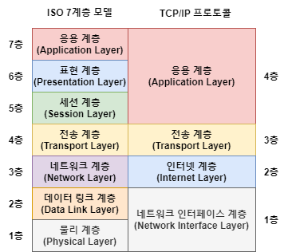
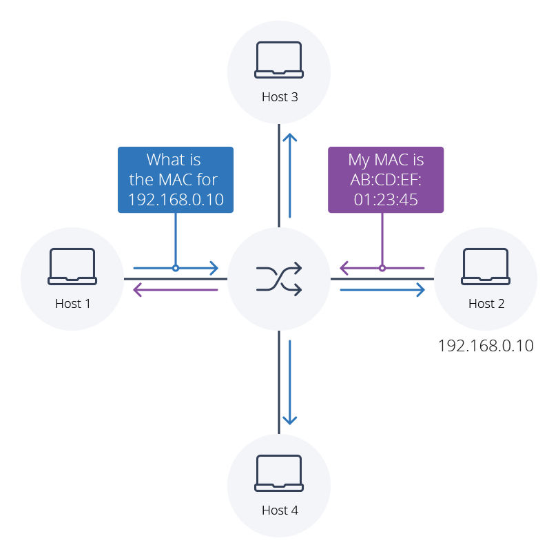

# 네트워크를 실현하는 기술
## 1. TCP/IP
TCP/IP는 인터넷 프로토콜 스위트라고 불리기도 하며, 다른 컴퓨터 벤더나 운영체제, 서로 다른 회선끼리 통신할 수 있게 하는 통신 프로토콜 세트이다.

TCP/IP는 TCP와 IP만을 가리키는 것이 아니라, 수많은 인터넷 통신 프로토콜 세트를 의미한다. TCP와 IP이외에도 UDP ICMP등 다른 프로토콜도 포함된다.

### TCP/IP 4계층 모델
TCP/IP에서 다루는 범위는 역할에 따라 4개의 계층으로 나뉜다.
높은 층에 해당할 수록 사용자에게 가깝고 낮을 수록 기기에 가깝다

|TCP/IP 4계층 모델|주요 프로토콜|역할|
|:---:|:---:|:---:|
|응용계층|HTTP,DNS 등|애플리케이션에 맞추어서 통신|
|전송계층|TCP,UDP|IP와 애플리케이션을 중개해서 송신된 데이터를 확실할게 전달|
|인터넷 계층|IP,ICMP,ARP 등|네트워크 주소를 기반으로 수신측 컴퓨터까지 데이터를 전송|
|네트워크 접근 계층|이더넷, 무선랜 등|물리적으로 네트워크에 연결해서 기기간에 전송할 수 있게 한다.|

### OSI 참조 모델

OSI참조 모델은 1계층(L1)부터 7계층(L7)까지 7개의 계층이 있으며 위 그림처럼 **L1,L2**는 **네트워크 접근 계층**, **L3**는 **인터넷 계층**, **L4**는 **전송계층**, **L5~L7**는 **응용계층**에 대응 되지만,  완벽하게 대칭은 아니다.

1. **물리계층 (Physical Layer)**:
    
    - 주요 기능: 물리적인 연결과 전기 신호 전송을 담당한다. 데이터를 비트로 변환하고 물리 매체를 통해 전송한다.
    - 단위: 비트 (Bits)
    - 예시 장치: 케이블, 리피터(Repeater)
2. **데이터 링크 계층 (Data Link Layer)**:
    
    - 주요 기능: 인접한 노드 간의 신뢰성 있는 데이터 전송을 관리합니다. 프레임 단위로 데이터를 관리하며, 오류 감지와 수정, 흐름 제어를 수행.
    - 단위: 프레임 (Frames)
    - 예시 장치: 스위치(Switch), 브리지(Bridge)
3. **네트워크 계층 (Network Layer)**:
    
    - 주요 기능: 데이터 패킷의 라우팅과 경로 선택을 관리한다. 다양한 노드 사이의 최적 경로를 결정하고, 패킷 전달을 보장.
    - 단위: 패킷 (Packets)
    - 예시 장치: 라우터(Router)
4. **전송 계층 (Transport Layer)**:
    
    - 주요 기능: 데이터를 신뢰성 있게 전송하며, 오류 복구와 흐름 제어를 제공한다. 데이터를 세그먼트로 나누고, 포트 번호를 통해 애플리케이션을 식별한다.
    - 단위: 세그먼트 (Segments)
    - 예시 프로토콜: TCP (Transmission Control Protocol), UDP (User Datagram Protocol)
5. **세션 계층 (Session Layer)**:
    
    - 주요 기능: 데이터 교환을 관리하고 동기화한다. 세션의 설정, 유지, 종료를 담당하며, 데이터 일관성을 유지함.
    - 단위: 없음
    - 예시: 세션 관리 프로토콜
6. **표현 계층 (Presentation Layer)**:
    
    - 주요 기능: 데이터의 형식 변환, 암호화, 압축 등을 처리하여 상호 운영 가능한 형태로 데이터를 전송한다.
    - 단위: 없음
    - 예시: 암호화, 압축 프로토콜
7. **응용 계층 (Application Layer)**:
    
    - 주요 기능: 최종 사용자에게 서비스를 제공하는 계층이며, 이메일, 웹 브라우징, 파일 전송 등 다양한 응용 프로그램이 이 계층에서 동작한다.
    - 단위: 메시지, 데이터
    - 예시 프로토콜: HTTP, FTP, SMTP, POP3

각 계층은 하위 계층으로부터 받은 데이터를 가공하고 상위 계층으로 전달한다. 이렇게 계층화된 구조는 네트워크 프로토콜의 설계, 유지 보수, 확장 등을 용이하게 만들어준다.

---

### 주소
통신에서 주소(address)란, '통신 상대를 특정하는 식별 정보'이다. 주소가 있기에 비로소 원하는 상대방과 통신할 수 있다.

**IP주소**는 tcp/ip에서 컴퓨터를 식별하려고 할당되는 번호이다. 컴퓨터나 휴대전화는 물론이고 서버, 라우터, 스위치등 네트워크 장비에도 ip주소가 할당된다.

또한 IP주소에는 프라이빗IP 주소와 글로벌 IP주소가 있다.  
**프라이빗 IP주소**는 랜 내부에서 사용되며, **글로벌 IP주소**는 인터넷에서 사용된다.

**MAC주소**
IP주소만 있다고 컴퓨터끼리 통신할 수 있는 것은 아니다. 컴퓨터나 라우터등 네트워크 기기에 처음부터 할당된 번호인 MAC주소를 IP주소와 조합해야 비로소 컴퓨터끼리 통신할 수 있다.

통신흐름은 다음과 같으며, ARP(Address Resolutopm Protocol)을 사용한다.
**같은 네트워크 내의 컴퓨터와 통신하는 흐름**과 **다른 네트워크의 컴퓨터와 통신하는 흐름** 두가지가 있다.

- **같은 네트워크에서의 통신 흐름**
1. ARP Request - IP주소에 대응하는 MAC주소를 알아내기 위해 네트워크 전체에 패킷을 request
2. ARP reply - 자신을 찾는 것을 안 컴퓨터가 응답을 준다.

> *네트워크 전체에 패킷을 보내는 것을 **브로드캐스트**라고 한다.*

- **다른 네트워크에서의 통신 흐름**
반면에 다른 네트워크에 속한 컴퓨터와 통신할 때는 네트워크 사이에 **라우터** 또는 **L3스위치**가 끼어든다.  
자신과 다른 네트워크의 IP주소와 통신을 할 때는
1. **기본 게이트웨이**의 IP주소로 통신을 보낸다. **기본 게이트웨이**는 다른 네트워크로 데이터를 전송하는 방법을 알고 있으며 일반적으로 **라우터**가 그 역할을 수행한다.
2. 이 때 ARP는 기본 게이트웨이에 대응하는 MAC주소를 응답한다. (다른 네트워크의 컴퓨터의 MAC주소가 아니다)

---
### 패킷
통신할 때 데이터를 교환하는 방법은 회선교환과 패킷 교환 두가지가 있다.
1. **회선 교환**
	- 데이터를 교환하는 동안 회선을 점유한다. 1대1로 컴퓨터가 데이터를 주고받는 동안 다른 컴퓨터가 데이터를 보낼 수 없기 때문에 이러한 방식은 효율적이지 않다.
2. . **패킷 교환**
	- 회선교환의 단점을 보완하기위한 방법으로 데이터를 패킷이라고 하는 작은 덩어리로 나누어서 회선을 공용으로 사용해서 복수의 통신을 내보내는 방식이다.
> 패킷은 헤더와 페이로드로 나뉘며 
> 헤더에는 보내는 곳과 받는곳의 정보 그리고 나누어진 데이터 순서등이 기록되고, 
> 페이로드에는 나누어진 데이턱 담기게 된다.

---

## 2. IP 주소

## 3. 네트워크 프로토콜