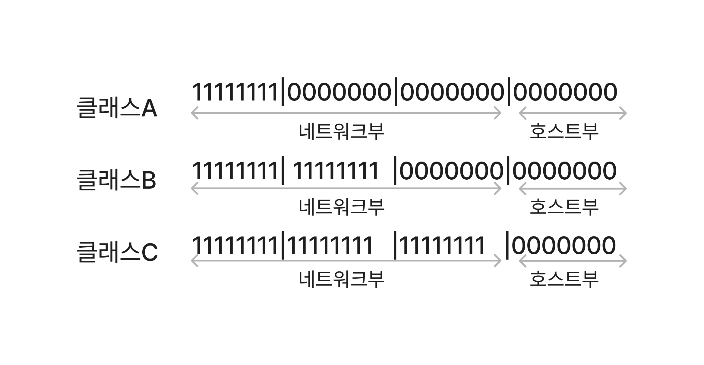

# 네트워크를 실현하는 기술
## 1. TCP/IP
TCP/IP는 인터넷 프로토콜 스위트라고 불리기도 하며, 다른 컴퓨터 벤더나 운영체제, 서로 다른 회선끼리 통신할 수 있게 하는 통신 프로토콜 세트이다.

TCP/IP는 TCP와 IP만을 가리키는 것이 아니라, 수많은 인터넷 통신 프로토콜 세트를 의미한다. TCP와 IP이외에도 UDP ICMP등 다른 프로토콜도 포함된다.

### TCP/IP 4계층 모델
TCP/IP에서 다루는 범위는 역할에 따라 4개의 계층으로 나뉜다.
높은 층에 해당할 수록 사용자에게 가깝고 낮을 수록 기기에 가깝다

|TCP/IP 4계층 모델|주요 프로토콜|역할|
|:---:|:---:|:---:|
|응용계층|HTTP,DNS 등|애플리케이션에 맞추어서 통신|
|전송계층|TCP,UDP|IP와 애플리케이션을 중개해서 송신된 데이터를 확실할게 전달|
|인터넷 계층|IP,ICMP,ARP 등|네트워크 주소를 기반으로 수신측 컴퓨터까지 데이터를 전송|
|네트워크 접근 계층|이더넷, 무선랜 등|물리적으로 네트워크에 연결해서 기기간에 전송할 수 있게 한다.|

### OSI 참조 모델

OSI참조 모델은 1계층(L1)부터 7계층(L7)까지 7개의 계층이 있으며 위 그림처럼 **L1,L2**는 **네트워크 접근 계층**, **L3**는 **인터넷 계층**, **L4**는 **전송계층**, **L5~L7**는 **응용계층**에 대응 되지만,  완벽하게 대칭은 아니다.

1. **물리계층 (Physical Layer)**:
    
    - 주요 기능: 물리적인 연결과 전기 신호 전송을 담당한다. 데이터를 비트로 변환하고 물리 매체를 통해 전송한다.
    - 단위: 비트 (Bits)
    - 예시 장치: 케이블, 리피터(Repeater)
2. **데이터 링크 계층 (Data Link Layer)**:
    
    - 주요 기능: 인접한 노드 간의 신뢰성 있는 데이터 전송을 관리합니다. 프레임 단위로 데이터를 관리하며, 오류 감지와 수정, 흐름 제어를 수행.
    - 단위: 프레임 (Frames)
    - 예시 장치: 스위치(Switch), 브리지(Bridge)
3. **네트워크 계층 (Network Layer)**:
    
    - 주요 기능: 데이터 패킷의 라우팅과 경로 선택을 관리한다. 다양한 노드 사이의 최적 경로를 결정하고, 패킷 전달을 보장.
    - 단위: 패킷 (Packets)
    - 예시 장치: 라우터(Router)
4. **전송 계층 (Transport Layer)**:
    
    - 주요 기능: 데이터를 신뢰성 있게 전송하며, 오류 복구와 흐름 제어를 제공한다. 데이터를 세그먼트로 나누고, 포트 번호를 통해 애플리케이션을 식별한다.
    - 단위: 세그먼트 (Segments)
    - 예시 프로토콜: TCP (Transmission Control Protocol), UDP (User Datagram Protocol)
5. **세션 계층 (Session Layer)**:
    
    - 주요 기능: 데이터 교환을 관리하고 동기화한다. 세션의 설정, 유지, 종료를 담당하며, 데이터 일관성을 유지함.
    - 단위: 없음
    - 예시: 세션 관리 프로토콜
6. **표현 계층 (Presentation Layer)**:
    
    - 주요 기능: 데이터의 형식 변환, 암호화, 압축 등을 처리하여 상호 운영 가능한 형태로 데이터를 전송한다.
    - 단위: 없음
    - 예시: 암호화, 압축 프로토콜
7. **응용 계층 (Application Layer)**:
    
    - 주요 기능: 최종 사용자에게 서비스를 제공하는 계층이며, 이메일, 웹 브라우징, 파일 전송 등 다양한 응용 프로그램이 이 계층에서 동작한다.
    - 단위: 메시지, 데이터
    - 예시 프로토콜: HTTP, FTP, SMTP, POP3

각 계층은 하위 계층으로부터 받은 데이터를 가공하고 상위 계층으로 전달한다. 이렇게 계층화된 구조는 네트워크 프로토콜의 설계, 유지 보수, 확장 등을 용이하게 만들어준다.

---

### 주소
통신에서 주소(address)란, '통신 상대를 특정하는 식별 정보'이다. 주소가 있기에 비로소 원하는 상대방과 통신할 수 있다.

**IP주소**는 tcp/ip에서 컴퓨터를 식별하려고 할당되는 번호이다. 컴퓨터나 휴대전화는 물론이고 서버, 라우터, 스위치등 네트워크 장비에도 ip주소가 할당된다.

또한 IP주소에는 프라이빗IP 주소와 글로벌 IP주소가 있다.  
**프라이빗 IP주소**는 랜 내부에서 사용되며, **글로벌 IP주소**는 인터넷에서 사용된다.

**MAC주소**
IP주소만 있다고 컴퓨터끼리 통신할 수 있는 것은 아니다. 컴퓨터나 라우터등 네트워크 기기에 처음부터 할당된 번호인 MAC주소를 IP주소와 조합해야 비로소 컴퓨터끼리 통신할 수 있다.

통신흐름은 다음과 같으며, ARP(Address Resolutopm Protocol)을 사용한다.
**같은 네트워크 내의 컴퓨터와 통신하는 흐름**과 **다른 네트워크의 컴퓨터와 통신하는 흐름** 두가지가 있다.

- **같은 네트워크에서의 통신 흐름**
1. ARP Request - IP주소에 대응하는 MAC주소를 알아내기 위해 네트워크 전체에 패킷을 request
2. ARP reply - 자신을 찾는 것을 안 컴퓨터가 응답을 준다.

> *네트워크 전체에 패킷을 보내는 것을 **브로드캐스트**라고 한다.*

- **다른 네트워크에서의 통신 흐름**
반면에 다른 네트워크에 속한 컴퓨터와 통신할 때는 네트워크 사이에 **라우터** 또는 **L3스위치**가 끼어든다.  
자신과 다른 네트워크의 IP주소와 통신을 할 때는
1. **기본 게이트웨이**의 IP주소로 통신을 보낸다. **기본 게이트웨이**는 다른 네트워크로 데이터를 전송하는 방법을 알고 있으며 일반적으로 **라우터**가 그 역할을 수행한다.
2. 이 때 ARP는 기본 게이트웨이에 대응하는 MAC주소를 응답한다. (다른 네트워크의 컴퓨터의 MAC주소가 아니다)

---
### 패킷
통신할 때 데이터를 교환하는 방법은 회선교환과 패킷 교환 두가지가 있다.
1. **회선 교환**
	- 데이터를 교환하는 동안 회선을 점유한다. 1대1로 컴퓨터가 데이터를 주고받는 동안 다른 컴퓨터가 데이터를 보낼 수 없기 때문에 이러한 방식은 효율적이지 않다.
2. . **패킷 교환**
	- 회선교환의 단점을 보완하기위한 방법으로 데이터를 패킷이라고 하는 작은 덩어리로 나누어서 회선을 공용으로 사용해서 복수의 통신을 내보내는 방식이다.
> 패킷은 헤더와 페이로드로 나뉘며 
> 헤더에는 보내는 곳과 받는곳의 정보 그리고 나누어진 데이터 순서등이 기록되고, 
> 페이로드에는 나누어진 데이턱 담기게 된다.

---

## 2. IP 주소
컴퓨터에 인터넷 회선을 최초로 연결하면 바로 인터넷에 연결되는 것을 볼 수 있다.  
이는 라우터에서 IP주소가 없는 컴퓨터에 IP주소를 자동으로 할당하는 기술인 **DHCP**이 있어서 가능한 것이다.

### DHCP (Dynamic Host Configuration Protocol)

그림출처 - [DHCP(Dynamic Host Configuration Protocol)란? - 로스카츠의 AI 머신러닝 (losskatsu.github.io)](https://losskatsu.github.io/os-kernel/dhcp/#2-dhcp%EC%9D%98-%EC%97%AD%ED%95%A0)
DHCP는 다음 네단계흐름에 따라 통신하여 네트워크 설정을 가져온다.
1. DHCP Discover : DHCP 클라이언트가 DHCP 서버를 찾고자 네트워크에 통신하는 것
3. DHCP Offer : DHCP 서버가 DHCP 클라이언트에 설정을 제안하는 통신을 하는 것
4. DHCP Request : DHCP 클라이언트가 DHCP 서버에 제안된 설정의 세부사항을 요청하는 통신을 하는 것
5. DHCP ACK : DHCP 서버가 DHCP 클라이언트에 설정의 세부 사항을 지정하는 통신을 하는 것

### 서브넷 마스크
IPc4 주소는 xxx.xxx.xxx.xxx 형식으로 표기한다. 10진수로 표현되지만 실제로는 8자리 2진수 4개이다.  
IP주소는 **네트워크부**와 **호스트부**로 나뉜다.

**네트워크부** - 어떤 네트워크를 나타내는 지에 대한 정보
**호스트부** - 그 네트워크 안의 컴퓨터를 특정하는 정보

IPv4에서 네트워크부가 어디부터 어디까지인지 나타내는 것이 **서브넷 마스크**(넷마스크) 이다.

IP주소 정보를 예를들어 설명하면
- IP주소 : 192.168.1.1
- 서브넷 마스크 : 255.255.255.0
- 네트워크주소 : 192.168.1.0
- 브로드캐스트 주소 :192.168.1.255

서브넷 마스크를 2진수로 표현하면 다음 그림과 같다.

여기서 1부분이 네트워크부이고 0 부분이 호스트부가 된다.  
8자리의 1진수 한덩어리를 옥텟이라고하고 이 경우 1옥텟부터 3옥텟까지가 네트워크부 4옥텟이 호스트부가 된다.

### IP주소 할당
앞서 말했듯이 IP주소는 처음부터 있는 것이아니라 따로 할당해서 사용한다.  
이 때 호스트부를 바꾸어서 IP주소를 할당한다.
>호스트부의 시작 숫자(2진수에서 모두 0일 때) 과 마지막 숫자(호스트부가 모두 1일 때)는 할당할 수 없다
> **시작 숫자**는 네트워크 주소라고 불리며 그 네트워크 자체를 나타낸다
> **마지막 숫자**는 브로드캐스트 주소이며, 로컬 네트워크 전체에 통신을 보낼 때 사용한다.
> *실제로는 라우터같은 네트워크 기기에도 IP주소가 할당되므로 실제로 컴퓨터나 프린터에 할당할 수 있는 IP는 더 줄어든다*

- **CIDR 표기법** - <네트워크 주소>/<서브넷 마스크의 비트수>  
	위에서 든 예시를 CIDR표기법으로 쓰면 192.168.1.0/24로 쓸 수 있다.

### 클래스 및 가변 길이 서브넷 마스크

IP주소는 네트워크부 길이에 따라 클래스가 나뉜다. 주요 클래스는 아래 그림과 같이 A,B,C 세가지 유형이다

서브넷 마스크가 반드시 클래스를 따르는 것은 아니며 클래스의 서브넷 마스크 길이를 변경할 수 있다.  
이를 **가변길이 서브넷 마스크** 라고 부른다.

호스트부를 늘리면 더 많은 컴퓨터에 IP를 할당할 수 있지만 ARP등으로 브로드캐스트 통신량이 증가하기 때문에 필요한 만큼 적절하게 설정해야한다.

### 데이터 전송 메커니즘
앞서서 MAC주소와 ARP 기술을 이용하여 데이터를 전송하는 흐름을 보았다.

다른 네트워크에 속한 컴퓨터와 통신할 때 흐름에 대해서 알아보자.  
각각 다른 네트워크에 속해 있는 컴퓨터 A,B,C가 있다.

1. **컴퓨터A -> 컴퓨터B**  
	컴퓨터 A가 컴퓨터B에 데이터를 보낼 때 어떤 라우터로 보내야 할지 모르는 경우 컴퓨터 A는 기본 게이트웨이라고 하는 라우터로 데이터를 송신한다. 위 상황에서는 라우터1이 기본 게이트웨이로 지정되어 있다.  
	위에서 라우터1은 네트워크 A와  네트워크 B에 모두 속해있으므로 컴퓨터 A의 데이터를 컴퓨터B로 전송할 수 있다.  
	이 때 라우터가 수행하는 작업을 **라우팅** 이라고 한다.

> 기본 게이트웨이란 '규정 수신처'를 의미하며, 전송할 라우터가 정해져 있지 않은 경우에는 반드시 이곳으로 보낸다고 규칙으로 정해 놓았다.

2. **컴퓨터A -> 컴퓨터C**  
	컴퓨터A는 **라우팅테이블**을 통해 네트워크C에 속한 컴퓨터C로 데이터를 보낼 때는 라우터2로 보낸다는 것을 알고 있다.  
	라우팅 테이블에는 네트워크로의 통신을 어느 라우터로 전달해야 하는지 기록되어 있다. 라우팅 테이블에 따라 기본 게이트웨이로 보내거나 직접 대상 라우터로 보낼 수 있는 구조로 되었다.
	
1. **라우터 -> 라우터**  
	인터넷이나 기업 네트워크에서는 라우터가 여러대 연결되어 있고, 그 라우터를 통해 통신한다.
	라우터 또한 기본 게이트웨이 (라우터는 기본 라우트라고 부른다) 가 있어서 보낼 곳을 모르는 네트워크가 있을 때는 기본 게이트웨이에 통신을 전송해 기본 라우터가 다신 전송처를 찾는 식으로 버킷 릴레이를 반복하여 네트워크가 성립된다.

---

## 3. 네트워크 프로토콜