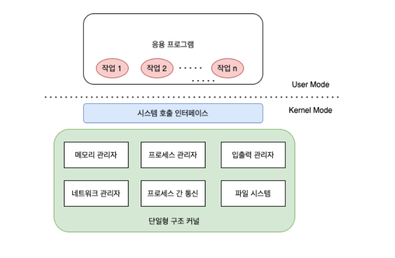

# Chapter 3 - 운영체제의 구조

## 1. 커널과 인터페이스
커널은 프로세스 관리, 메모리 관리, 저장장치 관리와 같은 운영체제의 핵심적인 기능을 모아놓은 것으로, 운영체제의 성능은 커널이 좌우한다.

운영체제는 크게 두 부분으로 나뉜다.  
사용자와 응용프로그램에 인접하여 커널에 명령을 전달하고 실행결과를 사용자와 응용 프로그램에 돌려주는 **인터페이스**와, 운영체제의 핵심기능을 모아놓은 **커널**이다.

같은 커널을 가지더라도 인터페이스가 다르면 다른 운영체제로 보인다.  
유닉스의 예시를 보면, 유닉스라는 운영체제는 사용자 인터페이스로 셸, C셸, bash셸등 여러 종류의 셸이 있다. 커널이 같더라도 사용자 인터페이스에 따라 사용자의 편리함이 많이 달라지기 때문에 좋은 커널보다는 좋은 인터페이스의 컴퓨터를 사용하려는 경향이 있다.
## 2. 시스템 호출과 디바이스 드라이버

1. **시스템 호출**(system call)   
   시스템 호출은 커널이 자신을 보호하기 위해 만든 **인터페이스** 이다. **사용자**나 **프로그램**이 시스템 자원을 사용하기 위해서는 커널이 제공하는 인터페이스 즉 시스템 호출을 사용해야 한다.  
   사용자나 프로그램이 시스템 호출을 통하지 않고 직접 자원에 접근하게 되면 컴퓨터 자원에 손상이 가거나 다른 프로그램, 사용자에게 영향이 갈 수 도 있기 때문에 시스템 호출을 통해서만 컴퓨터 자원에 접근할 수 있게 한다.
2. **드라이버**(driver)  
   응용 프로그램과 커널의 인터페이스가 시스템 호출이라면 커널과 **하드웨어의 인터페이스**는 **드라이버**가 담당한다.  
   엄청나게 많은 수의 하드웨어에 대한 모든 인터페이스를 운영체제 개발자가 직접 개발하기에는 어려움이 있다.  또한 하드웨어 제작자가 그 하드웨어의 특징을 잘 알고 있기 때문에 해당 인터페이스를 하드웨어 개발자가 개발하는 것이 더 유리할 것이다.
   커널 자체가 제공하는 드라이버와 하드웨어 제작자가 제공하는 드라이버를 통해 하드웨어가 커널과 연결이 된다.
## 3. 커널의 구성
운영체제의 핵심 기능을 모아놓은 커널이 주로 하는 일은 **프로세스 관리, 메모리 관리, 파일 시스템 관리, 입출력 관리, 프로세스 간 통신 관리** 등이 있다.  
커널의 핵심 기능은 유기적으로 복잡하게 얽혀 있다. 커널은 이러한 기능을 어떻게 구현 했는가에 따라 단일형 구조 커널, 계층형 구조 커널, 마이크로 구조 커널로 구분된다.
1. **단일형 구조 커널**  
   
   초창기의 운영체제 구조로 커널의 핵심 기능을 구현하는 모듈들이 구분 없이 하나로 구성되어 있다. 
   - **장점** : 모듈이 분리되지 않아 모듈간 통신 비용이 줄어 더 효율적으로 운영됨.
   - **단점** :
	   - 모듈이 하나라 버그나 오류 처리 힘들다.
	   - 운영체제의 여러 기능이 서로 연결되어 있어 상호 의존성이 높아져 기능 하나에 결함이 시스템 전체의 결함으로 이어진다.
	   - 다양한 환경의 시스템에 적용하기 힘들다.
	   - 현대의 운영체제는 크고 복잡해 단일형 구조의 운영체제를 구현하기 힘들다.
2. **계층형 구조 커널**  
   
계층형 구조는 단일형 구조커널이 발전된 형태이다. **비슷한 기능**을 가진 **모듈**을 묶어서 **하나의 계층**으로 만들고 계층 간의 통신을 통해 운영체제를 구현하는 방식이다.  

비슷한 기능을 모아 모듈화를 해서 단일형 구조보다 버그나 오류를 쉽게 처리할 수 있다.  
현대의 대부분의 운영체제는 이러한 구조로 이루어져 있다.
1. **마이크로 구조 커널**  
    
계층형 구조가 너무 거대해지면서 커널의 크기와 수용할 하드웨어의 용량이 늘어났으며, 오류도 늘어났다. 이러한 단점을 보완하기 위해 나온 커널이 마이크로 구조 커널이다.     
   
**마이크로 구조에서 커널** 의 운영체제는 프로세스 관리 , 메모리 관리, 프로세스간 통신 관리 등 가장 기본적인 기능만 제공한다.   

그림에서 보이는 것과 같이 커널은 3개의 기본적인 모듈로 이루어 져있고 나머지는 사용자 영역에 구현되어 있는 것을 볼 수 있다.  
커널에서 모듈을 사용하여 **단일형 구조 커널의 단점을 보완**하면서도 **이식성이 좋고**, **커널 자체가 가벼워서** CPU용량이 작은 시스템에도 적용이 가능하다.
## 4. 가상머신
C언어로 만든 운영체제인 유닉스는 윈도우처럼 다른 커널을 가진 운영체제와 호환성이 떨어진다. 한쪽 운영체제에서 개발한 프로그램 소스코드가 다른 운영체제에서는 동작하지 않게 된다는 것이다.  동일한 기능을 제공하는 소스코드를 운영체제별로 다시 짜야 되면 골치가 아파진다. 

이러한 **호환성 문제**를 해결한 언어가 **자바(JAVA)** 이다. 자바는 운영체제 위에 가상머신을 만들고 그 위에서  응용 프로그래밍이 작동하게 한다.

이런 식으로 다른 운영체제 환경에서 가상머신을 통해 응용프로그래밍을 통합할 수도 있고, 한 운영체제에서 가상머신을 통해 다른 운영체제를 사용할 수 있게된다.  (예를 들면 윈도우에서 가상머신VirtulaBox를 통해 리눅스를 실행하는 것)

하지만, 가상머신 위에서 돌리기 때문에 가상머신 위에서 돌아가는 것은 느려지는 단점이 있다.

