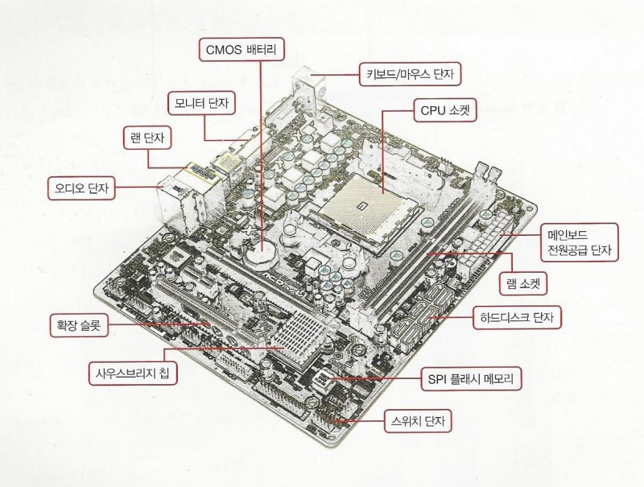
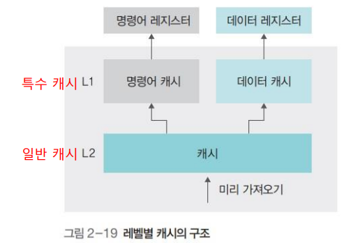
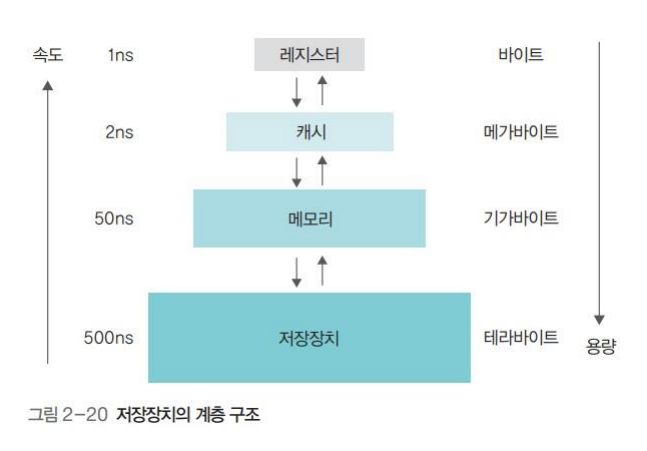
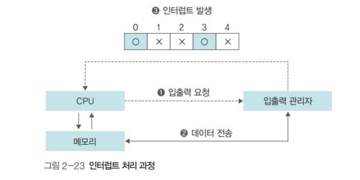

# 1 - 컴퓨터의 기본 구성

## 1. 하드웨어 구성
**필수장치** - 중앙처리장치(CPU), 메인 메모리  
**주변장치** - 입력장치, 출력장치(모니터, 스피커, 프린터 등), 저장장치(SSD, 하드디스크, CD 등)

**제 1 저장장치** - (휘발성 메모리) 메인 메모리  
**제 2 저장장치**(보조저장장치) - 하드디스크, SSD, usb등 

**메인보드** - 컴퓨터의 다양한 부품들은 버스로 연결된다. 버스는 각 장치를 연결하는 선의 집합이자 데이터가 지나다니는 통로이다.  
메인 보드는 컴퓨터 부품을 연결하는 커다란 판으로, 메인보드에 전력이 공급되면 버스로 연결된 컴퓨터 부품이 작동한다. 

그림 출처 [컴퓨터의 구조와 구성 요소 알아보기 : 네이버 블로그 (naver.com)](https://m.blog.naver.com/PostView.naver?isHttpsRedirect=true&blogId=yoschool&logNo=221133906904)

## 2. 폰 노이만 구조
CPU, 메모리, 입출력장치, 저장장치가 버스로 연결되어 있는 구조

폰노이만의 가장 중요한 특징은 '모든 프로그램은 메모리에 올라와야 실행할 수 있다'는 것이다.  
저장장치에 저장되어 있는 모든 프로그램들은 결국에 메모리에 올라와야 실행된다.
>하드웨어 사양관련 용어  
>- **클록**: CPU의 속도로 클록이 일정한 간격으로 틱을 만들면 cpu가 거기에 맞추어 작업을 한다.
>- **헤르츠**(Hz): 클록틱이 발생하는 속도를 나타내는 단위, 1초에 클록틱이 1000번이면 1000Hz
>- **시스템 버스**: 시스템 버스는 메모리와 주변장치를 연결하는 버스 (FSB, Front-Side Bus)
>- CPU내부 버스: CPU내부의 장치들을 연결하는 버스 (BSB, Back-Side Bus)

# 2 - CPU와 메모리
## 1. CPU의 구성과 동작

cpu는 기본적으로 산술논리 연상장치, 제어장치, 레지스터로 구성되어 있고 이것들의 협업으로 작업을 처리한다.
- **산술논리 연상장치**: 데이터의 덧셉, 뺄셈, 곱셈, 나눗셈 같은 산술연산과 AND, OR같은 논리연상 수행
- **제어장치**(Control Unit): 작업을 지시하는 부분 
- **레지스터**: CPU내에 데이터를 임시로 보관하는 곳

간단하게 cpu작업처리 과정을 말하자면 메모리로부터 **레지스터**에 데이터를 가져오고 **산술논리연산자**를 통해 **레지스터**의 값을 처리한다. 이 때 메모리로 부터 레지스터에 데이터를 가져오도록 하거나 그 값들을 연산을 하도록 하는 것은  
 **제어장치**가 그 역할을 수행한다.

### - **레지스터의 종류**  
사용자 프로그램에  의해 변경되는 레지스터를 사용자 **가시 레지스터(user-visible register)** 라고 부른다.
가시레지스터는 **데이터레지스터**와 **주소 레지스터** 두개가 있다.  
-  **데이터 레지스터**(DR): 메모리로 부터 임시로 가져온 데이터를 저장할 때 사용한다. CPU의 대부분의 레지스터가 데이터 레지스터이다.
- **주소 레지스터**(AR): 데이터 또는 명령어가 저장된 메모리의 주소를 저장
이 외에도 사용자 **불가시 레지스터(user-invisible register)** 라는 특수한 용도의 레지스터들이 존재한다.
- 프로그램 카운터 (PC) - 다음에 실행할 명령어의 위치정보(행번호 메모리 주소)를 저장
- 명령어 레지스터(IR) - 현재 실행중인 명령어 저장
- 메모리 주소 레지스터(MAR) - 메모리 관리자가 접근해야 할 메모리의 주소를 저장
- 메모리 버퍼 레지스터(MBR) - 메모리 관리자가 메모리에서 가져온 데이터를 임시로 저장
- 등등

### - **버스의 종류** 
**CPU내부 버스**: CPU내부의 레지스터, 산술논리 연산장치, 제어장치가 연결되어있다.

**시스템 버스**는 제어버스, 주소버스, 데이터버스 3가지가 있다.

**제어버스**: 제어장치와 연결된 버스를 CPU가 메모리와 주변장치에 **제어신호**를 보내기 위해 사용한다. 메모리와 주변장치에서도 작업이 완료되거나 오류가 발생하면 제어 신호를 보내기 때문에 양방향이다.

**주소버스**: 메모리 주소 레지스터와 연결된 버스로, 메모리나 주변장치에 데이터를 읽거나 쓸 때 **위치정보**를 보내기 위해 사용하며 단방향이다.

**데이터버스**: 메모리 버퍼 레지스터와 연결된 버스로 데이터의 이동이 양방향으로 이루어진다.

## 2. 메모리의 종류와 부팅
### - 메모리의 종류
메모리는 읽거나 쓸 수 있는 RAM(Random Access Memory) 과 읽기만 가능한 ROM(Read Only Memory)로 구분된다.

### - 메모리 보호
현대의 시분할 기법을 사용한 운영체제는 여러 프로그램이 동시에 실행이 되므로 각 프로그램이 사용하는 메모리영역이 서로 침범하면 안된다.  

>이를 악용하여 다른 프로그램을 망치거나 운영체제의 메모리영역을 침투하는 등의 악성 소프트웨어를  바이러스라고 한다.

메모리를 보호하기 위해 CPU는 현재 진행중인 작업의 메모리 시작주소를 경계 레지스터에 저장을하고 사용하고 있는 영역의 크기를 한계레지스터에 저장한다. 이 두 레지스터의 범위를 벗어나는지 하드웨어적으로 점검함으로써 메모리를 보호하게 된다.

# 3 - 컴퓨터 성능 향상 기술
CPU내부 버스의 속도가 시스템 버스의 속도보다 빠르다. 그래서 CPU에 비해 메모리같은 주변장치의 속도가 CPU를 따라가지 못한다. (하드디스크는 메모리보다 훨씬 느리다) 이러한 장치 간 속도차이를 개선하고 시스템의 작업 속도를 올리기 위해 개발된 운영체제 기술들을 소개한다.

## 1. 버퍼
데이터를 하나씩 하나씩 보내지 않고 모았다가 한번에 보낸다.

## 2. 캐시
캐시는 메모리와 CPU간의 속도 차이를 완화하기 위해 메모리의 데이터를 미리 가져와 저장해두는 임시 장소이다. CPU가 앞으로 사용할 것으로 예상되는 데이터를 미리 가져다 놓는다. 미리 가져와 두는 것을 **prefetch**라고 한다.

캐시는 CPU안에 있으며 CPU 내부 버스의 속도로 작동하기 때문에 빠르게 동작하는 CPU와 비교적 느리게 동작하는 메모리 사이에서 두 장치의 속도차이를 완화시켜준다.

CPU는 메모리를 참고할 일이 있을 때 먼저 캐시를 우선적으로 확인한다. 메모리에 접근해서 데이터를 가져오는 것 보다 속도가 빠를 것이다. 이 때 캐시에 데이터가 존재하면 **Cache hit**, 존재하지 않으면 **Cache miss**라고 한다. 이 때 cache hit의 비율을 **Cache ratio**라고 하며 cache ratio를 높여야 컴퓨터의 성능을 높일 수 있다.

- **캐시의 적중률을 높이는 방법은 무엇이 있을까**
1. 캐시의 크기를 늘린다.
2. 앞으로 사용될 데이터를 잘 예측해서 가져온다. - *현재 사용중인 메모리 위치에 가까운 데이터가 앞으로 사용될 가능성이 높다는 지역성(locality) 이론이 있다.*

- **캐시에 쓴 데이터를 메모리에 반영하는 방법**
1.  **즉시 쓰기** - 캐시의 데이터가 변경되는 즉시 메모리에 반영하지만 전송량이 많아 성능이 느려질 수 있다. 하지만 데이터 유실의 가능성은 줄어든다.
2.  **지연 쓰기** - 변경되는 내용을 모았다가 주기적으로 메모리에 반영한다. 성능은 빨라지지만 캐시와 메모리간 데이터 불일치 문제가 발생할 수도 있다.

- **L1캐시와 L2캐시**
프로그램의 명령어는 크게 어떤 작업을 할지 나타내는 **명령어 부분**과 작업 대상인 **데이터 부분**으로 나눌 수 있다.  
그리고 캐시는 명령어와 데이터의 구분 없이 모든 자료를 가져오는 **일반 캐시**와 명령어와 데이터를 구분해서 가져오는 **특수 캐시**라는 두가지 레벨로 구분된다.

이 때 특수 캐시를 **L1캐시**라고 부르고 일반 캐시를 **L2캐시**라고 부른다.  
*(특수 캐시는 cpu의 명령어 레지스터와 데이터 레지스터에 직접 연결되기 때문에 L1(Level 1)캐시.라고 한다.)*

## 3. **저장장치의 계층 구조**
빠른 장치일 수록 가격이 더 비싸기 때문에 CPU와 가까운 쪽에 빠르고 값이 비싸지만 용량이 적은 저장장치를 두고, 멀리갈 수록 싸고 느리지만 용량이 큰 저장장치를 배치하여서 적당한 가격으로 빠른속도와 용량 두가지를 동시에 얻는다.

## 4. 인터럽트
초기의 컴퓨터 시스템에는 주변장치가 많지 않아서 CPU가 직접 입출력 장치에서 데이터를 가져오거나 내보냈다.(polling방식) 이는 작업효율이 떨어지는 방식이다.  
이를 해결하기 위해 나온 개념이 **인터럽트(interrupt)방식** 이다. 데이터 입출력을 CPU작업에서 분리시켜서 시스템의 효율을 높였다.

- **동작방식**
1. CPU가 입출력 관리자에게 입출력 요청
2. 입출력 관리자가 메모리에 데이터 전송
3. 인터럽트 발생 (이때 CPU는 인터럽트 벡터로 한번에 여러개의 인터럽트를 처리할 수 있다.)

#  4 - 병렬 처리
병렬 처리는 여러 작업을 동시에 실행하여 시스템의 성능을 향상시키는 기술이다. 이를 통해 작업들이 동시에 처리되므로 전체적인 처리 시간이 단축되거나 시스템의 성능이 향상될 수 있다. 운영체제에서 사용되는 주요한 병렬 처리 기법으로는 **파이프라인(pipeline)**과 **슈퍼스칼라(super-scalar)**가 있다.

1. **파이프라인** (Pipeline): 파이프라인은 여러 단계로 구성된 작업을 여러 개의 부분 작업으로 분할하여 동시에 처리하는 기법이다. 각 단계는 이전 단계의 결과를 받아 처리하고, 그 결과를 다음 단계로 전달한다. 이렇게 각 단계가 병렬로 처리되므로 전체 작업이 순차적으로 처리되는 것보다 효율적이게 된다.

 CPU 파이프라인은 명령어를 가져오는(fetch), 해독하는(decode), 실행하는(execute), 메모리에 접근하는(memory access) 등의 단계로 나누어 작업을 처리한다. 한 번에 하나의 명령어가 실행되는 대신, 파이프라인을 사용하면 동시에 여러 명령어가 실행될 수 있다.

2. **슈퍼스칼라** (Super-scalar): 슈퍼스칼라는 여러 개의 실행 유닛(멀티코어)를 가진 프로세서를 사용하여 병렬 처리를 구현하는 기법이다. 슈퍼스칼라 프로세서는 단일 클럭 주기 동안 여러 개의 명령어를 동시에 실행할 수 있도록 설계되어 있다.

슈퍼스칼라 프로세서는 명령어를 독립적으로 분석하고, 동시에 실행 가능한 명령어들을 찾아 여러 개의 실행 유닛(코어)에서 병렬로 처리한다. 이를 통해 한 번에 여러 명령어를 동시에 실행하여 성능을 향상시킬 수 있다. 

