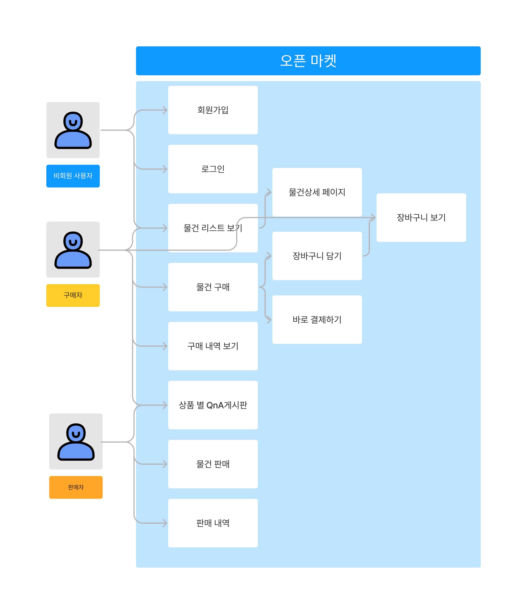

# 스프링부트 쇼핑몰 만들기 프로젝트 시작
```toc
```

## 개요
스프링부트 공부를 위해 쇼핑몰 만들기 프로젝트를 시작한다.  

대강의 설계 후 기능별로 차근차근 구현해보면서 스프링 부트에 대해 공부해볼 예정.

## 설계
### 소개

모든 회원이 상품을 등록할 수 있고, 모든 회원이 상품을 살 수 있는 오픈마켓 형태의 쇼핑몰

필요한 기능들을 대강적으로 생각해보면 회원에 대한 기본적인 구현, 상품에 대한 CRUD, 상품 구매 및 판매 관리(구매, 판매, 구매 이력, 판매 이력등)이 있을 것 같다.

### UseCase



